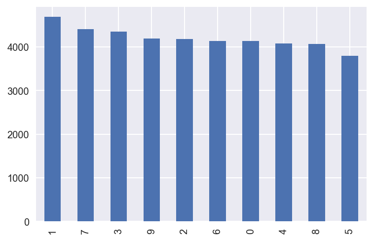
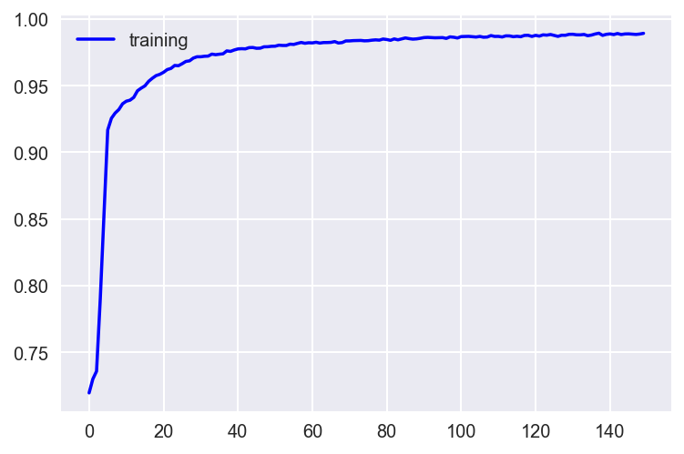
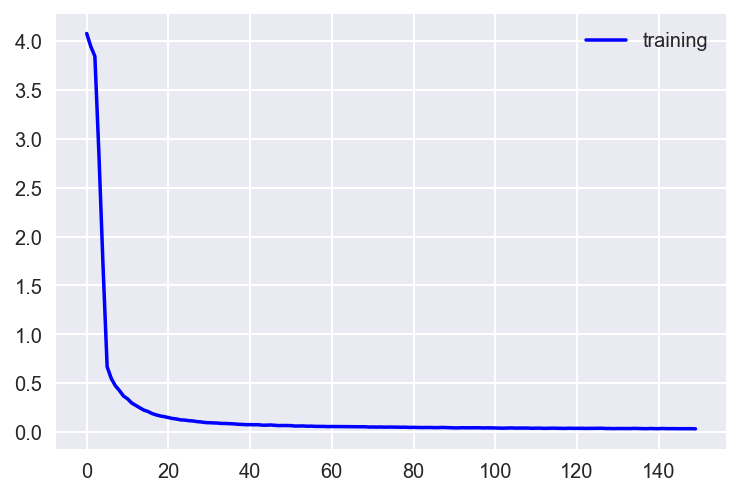

## 1. Introduce 

In this project, I will design and implement a deep learning model that learns to recognize sequences of digits. We will train the model using synthetic data generated by concatenating character images from MNIST.

I will use Keras to implement the model. First of all, I am going to import the modules which are required for this project


```python
import numpy as np
import pandas as pd
from sklearn.preprocessing import OneHotEncoder

from keras.models import Sequential
from keras.layers import Conv2D, MaxPooling2D, Flatten, Dense, Dropout
from keras.optimizers import Adadelta
from keras.regularizers import l2
```

    Using TensorFlow backend.


### 1.1  Import Data 


```python
# Load the dataset
train = pd.read_csv("./Input/train.csv")
test = pd.read_csv("./Input/test.csv")

import matplotlib.pyplot as plt
%matplotlib inline

# Display the first record
display(train.head(n=1))
```


<div>
<style>
    .dataframe thead tr:only-child th {
        text-align: right;
    }

    .dataframe thead th {
        text-align: left;
    }

    .dataframe tbody tr th {
        vertical-align: top;
    }
</style>
<table border="1" class="dataframe">
  <thead>
    <tr style="text-align: right;">
      <th></th>
      <th>label</th>
      <th>pixel0</th>
      <th>pixel1</th>
      <th>pixel2</th>
      <th>pixel3</th>
      <th>pixel4</th>
      <th>pixel5</th>
      <th>pixel6</th>
      <th>pixel7</th>
      <th>pixel8</th>
      <th>...</th>
      <th>pixel774</th>
      <th>pixel775</th>
      <th>pixel776</th>
      <th>pixel777</th>
      <th>pixel778</th>
      <th>pixel779</th>
      <th>pixel780</th>
      <th>pixel781</th>
      <th>pixel782</th>
      <th>pixel783</th>
    </tr>
  </thead>
  <tbody>
    <tr>
      <th>0</th>
      <td>1</td>
      <td>0</td>
      <td>0</td>
      <td>0</td>
      <td>0</td>
      <td>0</td>
      <td>0</td>
      <td>0</td>
      <td>0</td>
      <td>0</td>
      <td>...</td>
      <td>0</td>
      <td>0</td>
      <td>0</td>
      <td>0</td>
      <td>0</td>
      <td>0</td>
      <td>0</td>
      <td>0</td>
      <td>0</td>
      <td>0</td>
    </tr>
  </tbody>
</table>
<p>1 rows × 785 columns</p>
</div>


### 1.2 Check Data


```python
# Save label data 
column_target = [x for x in train.columns if x not in test.columns]
labels = train[column_target]
```


```python
column_target
```


    ['label']


```python
#Distribution of the digits in the dataset
labels.iloc[:,0].value_counts().plot(kind='bar')
plt.show()
```





comments :

1. Number of labels in order of numbers 1, 7, 3, 9, 2, 6, 0, 4, 8, 5
2. The output variable is an integer from 0 to 9. This is a multiclass classification problem.

### 1.3 One hot encoding for Label data

A one-hot vector is a vector which is 0 in most dimensions, and 1 in a single dimension. In this case, the nth digit will be represented as a vector which is 1 in the nth dimension.

For example, 3 would be [0,0,0,1,0,0,0,0,0,0].


```python
# One hot encoding for labels
ohe = OneHotEncoder()
ohe.fit(labels)
ohe.n_values_, ohe.feature_indices_, ohe.active_features_
```


    (array([10]), array([ 0, 10]), array([0, 1, 2, 3, 4, 5, 6, 7, 8, 9]))


```python
# Save one hot encoded label data at y_train
y_train = ohe.transform(labels).toarray()
```


```python
# Remove target data from train set (labels)
X_train = train.drop(column_target, axis=1)
```


```python
print("X_train shape: {}. Test shape: {}. Target shape {}".format(X_train.shape, test.shape, labels.shape))
X_train.head()
```

    X_train shape: (42000, 784). Test shape: (28000, 784). Target shape (42000, 1)


<div>
<style>
    .dataframe thead tr:only-child th {
        text-align: right;
    }

    .dataframe thead th {
        text-align: left;
    }

    .dataframe tbody tr th {
        vertical-align: top;
    }
</style>
<table border="1" class="dataframe">
  <thead>
    <tr style="text-align: right;">
      <th></th>
      <th>pixel0</th>
      <th>pixel1</th>
      <th>pixel2</th>
      <th>pixel3</th>
      <th>pixel4</th>
      <th>pixel5</th>
      <th>pixel6</th>
      <th>pixel7</th>
      <th>pixel8</th>
      <th>pixel9</th>
      <th>...</th>
      <th>pixel774</th>
      <th>pixel775</th>
      <th>pixel776</th>
      <th>pixel777</th>
      <th>pixel778</th>
      <th>pixel779</th>
      <th>pixel780</th>
      <th>pixel781</th>
      <th>pixel782</th>
      <th>pixel783</th>
    </tr>
  </thead>
  <tbody>
    <tr>
      <th>0</th>
      <td>0</td>
      <td>0</td>
      <td>0</td>
      <td>0</td>
      <td>0</td>
      <td>0</td>
      <td>0</td>
      <td>0</td>
      <td>0</td>
      <td>0</td>
      <td>...</td>
      <td>0</td>
      <td>0</td>
      <td>0</td>
      <td>0</td>
      <td>0</td>
      <td>0</td>
      <td>0</td>
      <td>0</td>
      <td>0</td>
      <td>0</td>
    </tr>
    <tr>
      <th>1</th>
      <td>0</td>
      <td>0</td>
      <td>0</td>
      <td>0</td>
      <td>0</td>
      <td>0</td>
      <td>0</td>
      <td>0</td>
      <td>0</td>
      <td>0</td>
      <td>...</td>
      <td>0</td>
      <td>0</td>
      <td>0</td>
      <td>0</td>
      <td>0</td>
      <td>0</td>
      <td>0</td>
      <td>0</td>
      <td>0</td>
      <td>0</td>
    </tr>
    <tr>
      <th>2</th>
      <td>0</td>
      <td>0</td>
      <td>0</td>
      <td>0</td>
      <td>0</td>
      <td>0</td>
      <td>0</td>
      <td>0</td>
      <td>0</td>
      <td>0</td>
      <td>...</td>
      <td>0</td>
      <td>0</td>
      <td>0</td>
      <td>0</td>
      <td>0</td>
      <td>0</td>
      <td>0</td>
      <td>0</td>
      <td>0</td>
      <td>0</td>
    </tr>
    <tr>
      <th>3</th>
      <td>0</td>
      <td>0</td>
      <td>0</td>
      <td>0</td>
      <td>0</td>
      <td>0</td>
      <td>0</td>
      <td>0</td>
      <td>0</td>
      <td>0</td>
      <td>...</td>
      <td>0</td>
      <td>0</td>
      <td>0</td>
      <td>0</td>
      <td>0</td>
      <td>0</td>
      <td>0</td>
      <td>0</td>
      <td>0</td>
      <td>0</td>
    </tr>
    <tr>
      <th>4</th>
      <td>0</td>
      <td>0</td>
      <td>0</td>
      <td>0</td>
      <td>0</td>
      <td>0</td>
      <td>0</td>
      <td>0</td>
      <td>0</td>
      <td>0</td>
      <td>...</td>
      <td>0</td>
      <td>0</td>
      <td>0</td>
      <td>0</td>
      <td>0</td>
      <td>0</td>
      <td>0</td>
      <td>0</td>
      <td>0</td>
      <td>0</td>
    </tr>
  </tbody>
</table>
<p>5 rows × 784 columns</p>
</div>


### 1.4 Analyse the pixels


```python
#Analyse the pixels intensity values
subset_pixels = X_train.iloc[:, :]
subset_pixels.describe()
```


<div>
<style>
    .dataframe thead tr:only-child th {
        text-align: right;
    }

    .dataframe thead th {
        text-align: left;
    }

    .dataframe tbody tr th {
        vertical-align: top;
    }
</style>
<table border="1" class="dataframe">
  <thead>
    <tr style="text-align: right;">
      <th></th>
      <th>pixel0</th>
      <th>pixel1</th>
      <th>pixel2</th>
      <th>pixel3</th>
      <th>pixel4</th>
      <th>pixel5</th>
      <th>pixel6</th>
      <th>pixel7</th>
      <th>pixel8</th>
      <th>pixel9</th>
      <th>...</th>
      <th>pixel774</th>
      <th>pixel775</th>
      <th>pixel776</th>
      <th>pixel777</th>
      <th>pixel778</th>
      <th>pixel779</th>
      <th>pixel780</th>
      <th>pixel781</th>
      <th>pixel782</th>
      <th>pixel783</th>
    </tr>
  </thead>
  <tbody>
    <tr>
      <th>count</th>
      <td>42000.0</td>
      <td>42000.0</td>
      <td>42000.0</td>
      <td>42000.0</td>
      <td>42000.0</td>
      <td>42000.0</td>
      <td>42000.0</td>
      <td>42000.0</td>
      <td>42000.0</td>
      <td>42000.0</td>
      <td>...</td>
      <td>42000.000000</td>
      <td>42000.000000</td>
      <td>42000.000000</td>
      <td>42000.00000</td>
      <td>42000.000000</td>
      <td>42000.000000</td>
      <td>42000.0</td>
      <td>42000.0</td>
      <td>42000.0</td>
      <td>42000.0</td>
    </tr>
    <tr>
      <th>mean</th>
      <td>0.0</td>
      <td>0.0</td>
      <td>0.0</td>
      <td>0.0</td>
      <td>0.0</td>
      <td>0.0</td>
      <td>0.0</td>
      <td>0.0</td>
      <td>0.0</td>
      <td>0.0</td>
      <td>...</td>
      <td>0.219286</td>
      <td>0.117095</td>
      <td>0.059024</td>
      <td>0.02019</td>
      <td>0.017238</td>
      <td>0.002857</td>
      <td>0.0</td>
      <td>0.0</td>
      <td>0.0</td>
      <td>0.0</td>
    </tr>
    <tr>
      <th>std</th>
      <td>0.0</td>
      <td>0.0</td>
      <td>0.0</td>
      <td>0.0</td>
      <td>0.0</td>
      <td>0.0</td>
      <td>0.0</td>
      <td>0.0</td>
      <td>0.0</td>
      <td>0.0</td>
      <td>...</td>
      <td>6.312890</td>
      <td>4.633819</td>
      <td>3.274488</td>
      <td>1.75987</td>
      <td>1.894498</td>
      <td>0.414264</td>
      <td>0.0</td>
      <td>0.0</td>
      <td>0.0</td>
      <td>0.0</td>
    </tr>
    <tr>
      <th>min</th>
      <td>0.0</td>
      <td>0.0</td>
      <td>0.0</td>
      <td>0.0</td>
      <td>0.0</td>
      <td>0.0</td>
      <td>0.0</td>
      <td>0.0</td>
      <td>0.0</td>
      <td>0.0</td>
      <td>...</td>
      <td>0.000000</td>
      <td>0.000000</td>
      <td>0.000000</td>
      <td>0.00000</td>
      <td>0.000000</td>
      <td>0.000000</td>
      <td>0.0</td>
      <td>0.0</td>
      <td>0.0</td>
      <td>0.0</td>
    </tr>
    <tr>
      <th>25%</th>
      <td>0.0</td>
      <td>0.0</td>
      <td>0.0</td>
      <td>0.0</td>
      <td>0.0</td>
      <td>0.0</td>
      <td>0.0</td>
      <td>0.0</td>
      <td>0.0</td>
      <td>0.0</td>
      <td>...</td>
      <td>0.000000</td>
      <td>0.000000</td>
      <td>0.000000</td>
      <td>0.00000</td>
      <td>0.000000</td>
      <td>0.000000</td>
      <td>0.0</td>
      <td>0.0</td>
      <td>0.0</td>
      <td>0.0</td>
    </tr>
    <tr>
      <th>50%</th>
      <td>0.0</td>
      <td>0.0</td>
      <td>0.0</td>
      <td>0.0</td>
      <td>0.0</td>
      <td>0.0</td>
      <td>0.0</td>
      <td>0.0</td>
      <td>0.0</td>
      <td>0.0</td>
      <td>...</td>
      <td>0.000000</td>
      <td>0.000000</td>
      <td>0.000000</td>
      <td>0.00000</td>
      <td>0.000000</td>
      <td>0.000000</td>
      <td>0.0</td>
      <td>0.0</td>
      <td>0.0</td>
      <td>0.0</td>
    </tr>
    <tr>
      <th>75%</th>
      <td>0.0</td>
      <td>0.0</td>
      <td>0.0</td>
      <td>0.0</td>
      <td>0.0</td>
      <td>0.0</td>
      <td>0.0</td>
      <td>0.0</td>
      <td>0.0</td>
      <td>0.0</td>
      <td>...</td>
      <td>0.000000</td>
      <td>0.000000</td>
      <td>0.000000</td>
      <td>0.00000</td>
      <td>0.000000</td>
      <td>0.000000</td>
      <td>0.0</td>
      <td>0.0</td>
      <td>0.0</td>
      <td>0.0</td>
    </tr>
    <tr>
      <th>max</th>
      <td>0.0</td>
      <td>0.0</td>
      <td>0.0</td>
      <td>0.0</td>
      <td>0.0</td>
      <td>0.0</td>
      <td>0.0</td>
      <td>0.0</td>
      <td>0.0</td>
      <td>0.0</td>
      <td>...</td>
      <td>254.000000</td>
      <td>254.000000</td>
      <td>253.000000</td>
      <td>253.00000</td>
      <td>254.000000</td>
      <td>62.000000</td>
      <td>0.0</td>
      <td>0.0</td>
      <td>0.0</td>
      <td>0.0</td>
    </tr>
  </tbody>
</table>
<p>8 rows × 784 columns</p>
</div>


comments:

1. Training data is 42,000 ea
1. There is no missing values


```python
image_size = X_train.shape[1]
print("Number of pixels for each image: {}".format(image_size))
print("Pixels ranges from {} to {}".format(X_train.values.min(), X_train.values.max()))

image_width = image_height = np.ceil(np.sqrt(image_size)).astype(np.int)
print("Image size: {}x{}".format(image_width, image_height))
```

    Number of pixels for each image: 784
    Pixels ranges from 0 to 255
    Image size: 28x28


```python
# check index 1's image
index = 1    
image = X_train.ix[index, :].values
label = labels.values[index]
    
plt.axis('off')
plt.imshow(image.reshape(image_width, image_height),)
print("It is a {}".format(label))
```

    It is a [0]


    /Users/sunghwanki/anaconda3/lib/python3.6/site-packages/ipykernel_launcher.py:3: DeprecationWarning: 
    .ix is deprecated. Please use
    .loc for label based indexing or
    .iloc for positional indexing
    
    See the documentation here:
    http://pandas.pydata.org/pandas-docs/stable/indexing.html#ix-indexer-is-deprecated
      This is separate from the ipykernel package so we can avoid doing imports until


### 2 Model

### 2.1 Preprocessing the digit images


```python
# Convert data frame to array format
X_train0=np.array(X_train)
test0=np.array(test)
```


```python
# Reshape image dimensions
X_train1=X_train0.reshape(42000,28,28)
X_test1=test0.reshape(28000,28,28)
```


```python
# Increase dimension one more
X_train = X_train1[:, :, :, np.newaxis]
X_test = X_test1[:, :, :, np.newaxis]
```


```python
X_train.shape
```


    (42000, 28, 28, 1)


```python
y_train.shape
```


    (42000, 10)


### 2.2 Designing Neural Network Architecture 

Create a model from Keras Sequential layer.

In Keras, I build the model one layer at a time. For each layer, I need to specify the number of filter(4ea) and filter size (5 X 5) and the activation function(relu).

I also need to specify the number of inputs (28 X 28 X 1).


```python
np.random.seed(0)

# Create Sequential model(Linear stack of layers)
model = Sequential()

# 1st layer
model.add(Conv2D(4, (5, 5), activation='relu', input_shape=(28, 28, 1), padding='Same',kernel_initializer="glorot_uniform"))
model.add(MaxPooling2D())
model.add(Dropout(0.1))

# 2nd layer
model.add(Conv2D(4, (5, 5), activation='relu', kernel_initializer="glorot_uniform"))
model.add(Flatten())
model.add(Dense(10, activation='softmax', kernel_initializer="glorot_uniform"))

np.random.seed(0)
```

I specifiy how the model is optimized by choosing the optimization algorithm and the cost (or loss) function. The Adam optimization algorithm works well across a wide range of neural network architectures


```python
# compile the model
model.compile(loss='categorical_crossentropy', metrics=['accuracy'], optimizer=Adam())
```


```python
model.summary()
```

    _________________________________________________________________
    Layer (type)                 Output Shape              Param #   
    =================================================================
    conv2d_7 (Conv2D)            (None, 28, 28, 4)         104       
    _________________________________________________________________
    max_pooling2d_4 (MaxPooling2 (None, 14, 14, 4)         0         
    _________________________________________________________________
    dropout_3 (Dropout)          (None, 14, 14, 4)         0         
    _________________________________________________________________
    conv2d_8 (Conv2D)            (None, 10, 10, 4)         404       
    _________________________________________________________________
    flatten_3 (Flatten)          (None, 400)               0         
    _________________________________________________________________
    dense_3 (Dense)              (None, 10)                4010      
    =================================================================
    Total params: 4,518
    Trainable params: 4,518
    Non-trainable params: 0
    _________________________________________________________________


### 2.3 Ready to run the model. 

We need to decide on the number epochs. or iterations, and the batch size, which represents the number of training examples that will be processed in each epoch. 


```python
# Show the loss and accuracy
%%time
hist1 = model.fit(X_train, y_train, epochs=150, batch_size=600, verbose=2)
```

    Epoch 1/150
     - 8s - loss: 4.0800 - acc: 0.7195
    Epoch 2/150
     - 8s - loss: 3.9469 - acc: 0.7298
    Epoch 3/150
     - 8s - loss: 3.8461 - acc: 0.7357
    Epoch 4/150
     - 8s - loss: 2.8348 - acc: 0.7900
    Epoch 5/150
     - 8s - loss: 1.6937 - acc: 0.8530
    Epoch 6/150
     - 8s - loss: 0.6679 - acc: 0.9168
    Epoch 7/150
     - 8s - loss: 0.5495 - acc: 0.9256
    Epoch 8/150
     - 8s - loss: 0.4744 - acc: 0.9295
    Epoch 9/150
     - 8s - loss: 0.4248 - acc: 0.9322
    Epoch 10/150
     - 8s - loss: 0.3686 - acc: 0.9365
    Epoch 11/150
     - 8s - loss: 0.3396 - acc: 0.9384
    Epoch 12/150
     - 8s - loss: 0.2975 - acc: 0.9392
    Epoch 13/150
     - 8s - loss: 0.2726 - acc: 0.9413
    Epoch 14/150
     - 8s - loss: 0.2475 - acc: 0.9462
    Epoch 15/150
     - 8s - loss: 0.2241 - acc: 0.9482
    Epoch 16/150
     - 8s - loss: 0.2097 - acc: 0.9499
    Epoch 17/150
     - 8s - loss: 0.1890 - acc: 0.9533
    Epoch 18/150
     - 8s - loss: 0.1750 - acc: 0.9556
    Epoch 19/150
     - 8s - loss: 0.1644 - acc: 0.9576
    Epoch 20/150
     - 8s - loss: 0.1569 - acc: 0.9585
    Epoch 21/150
     - 8s - loss: 0.1473 - acc: 0.9601
    Epoch 22/150
     - 8s - loss: 0.1384 - acc: 0.9621
    Epoch 23/150
     - 8s - loss: 0.1333 - acc: 0.9630
    Epoch 24/150
     - 8s - loss: 0.1243 - acc: 0.9652
    Epoch 25/150
     - 8s - loss: 0.1220 - acc: 0.9650
    Epoch 26/150
     - 8s - loss: 0.1160 - acc: 0.9665
    Epoch 27/150
     - 8s - loss: 0.1130 - acc: 0.9682
    Epoch 28/150
     - 8s - loss: 0.1067 - acc: 0.9687
    Epoch 29/150
     - 8s - loss: 0.1029 - acc: 0.9707
    Epoch 30/150
     - 8s - loss: 0.0970 - acc: 0.9717
    Epoch 31/150
     - 8s - loss: 0.0948 - acc: 0.9717
    Epoch 32/150
     - 8s - loss: 0.0931 - acc: 0.9721
    Epoch 33/150
     - 8s - loss: 0.0916 - acc: 0.9722
    Epoch 34/150
     - 8s - loss: 0.0878 - acc: 0.9737
    Epoch 35/150
     - 8s - loss: 0.0874 - acc: 0.9733
    Epoch 36/150
     - 8s - loss: 0.0851 - acc: 0.9737
    Epoch 37/150
     - 8s - loss: 0.0832 - acc: 0.9740
    Epoch 38/150
     - 8s - loss: 0.0791 - acc: 0.9761
    Epoch 39/150
     - 8s - loss: 0.0779 - acc: 0.9758
    Epoch 40/150
     - 8s - loss: 0.0749 - acc: 0.9768
    Epoch 41/150
     - 8s - loss: 0.0755 - acc: 0.9776
    Epoch 42/150
     - 8s - loss: 0.0742 - acc: 0.9778
    Epoch 43/150
     - 8s - loss: 0.0748 - acc: 0.9777
    Epoch 44/150
     - 8s - loss: 0.0697 - acc: 0.9786
    Epoch 45/150
     - 8s - loss: 0.0699 - acc: 0.9787
    Epoch 46/150
     - 8s - loss: 0.0720 - acc: 0.9781
    Epoch 47/150
     - 8s - loss: 0.0690 - acc: 0.9782
    Epoch 48/150
     - 8s - loss: 0.0656 - acc: 0.9792
    Epoch 49/150
     - 8s - loss: 0.0668 - acc: 0.9793
    Epoch 50/150
     - 8s - loss: 0.0662 - acc: 0.9796
    Epoch 51/150
     - 8s - loss: 0.0654 - acc: 0.9797
    Epoch 52/150
     - 8s - loss: 0.0610 - acc: 0.9804
    Epoch 53/150
     - 8s - loss: 0.0619 - acc: 0.9802
    Epoch 54/150
     - 8s - loss: 0.0619 - acc: 0.9802
    Epoch 55/150
     - 8s - loss: 0.0592 - acc: 0.9812
    Epoch 56/150
     - 8s - loss: 0.0601 - acc: 0.9810
    Epoch 57/150
     - 8s - loss: 0.0577 - acc: 0.9818
    Epoch 58/150
     - 8s - loss: 0.0577 - acc: 0.9825
    Epoch 59/150
     - 8s - loss: 0.0573 - acc: 0.9819
    Epoch 60/150
     - 8s - loss: 0.0554 - acc: 0.9823
    Epoch 61/150
     - 8s - loss: 0.0563 - acc: 0.9821
    Epoch 62/150
     - 8s - loss: 0.0558 - acc: 0.9826
    Epoch 63/150
     - 8s - loss: 0.0563 - acc: 0.9820
    Epoch 64/150
     - 8s - loss: 0.0555 - acc: 0.9824
    Epoch 65/150
     - 8s - loss: 0.0540 - acc: 0.9824
    Epoch 66/150
     - 8s - loss: 0.0542 - acc: 0.9825
    Epoch 67/150
     - 8s - loss: 0.0529 - acc: 0.9831
    Epoch 68/150
     - 8s - loss: 0.0538 - acc: 0.9821
    Epoch 69/150
     - 8s - loss: 0.0539 - acc: 0.9824
    Epoch 70/150
     - 8s - loss: 0.0508 - acc: 0.9836
    Epoch 71/150
     - 8s - loss: 0.0514 - acc: 0.9836
    Epoch 72/150
     - 8s - loss: 0.0502 - acc: 0.9839
    Epoch 73/150
     - 8s - loss: 0.0514 - acc: 0.9839
    Epoch 74/150
     - 8s - loss: 0.0496 - acc: 0.9840
    Epoch 75/150
     - 8s - loss: 0.0506 - acc: 0.9837
    Epoch 76/150
     - 8s - loss: 0.0504 - acc: 0.9838
    Epoch 77/150
     - 8s - loss: 0.0497 - acc: 0.9842
    Epoch 78/150
     - 8s - loss: 0.0486 - acc: 0.9844
    Epoch 79/150
     - 8s - loss: 0.0492 - acc: 0.9842
    Epoch 80/150
     - 8s - loss: 0.0469 - acc: 0.9850
    Epoch 81/150
     - 8s - loss: 0.0474 - acc: 0.9847
    Epoch 82/150
     - 8s - loss: 0.0465 - acc: 0.9841
    Epoch 83/150
     - 8s - loss: 0.0457 - acc: 0.9851
    Epoch 84/150
     - 8s - loss: 0.0466 - acc: 0.9845
    Epoch 85/150
     - 7s - loss: 0.0464 - acc: 0.9851
    Epoch 86/150
     - 7s - loss: 0.0450 - acc: 0.9859
    Epoch 87/150
     - 7s - loss: 0.0448 - acc: 0.9854
    Epoch 88/150
     - 8s - loss: 0.0468 - acc: 0.9850
    Epoch 89/150
     - 8s - loss: 0.0457 - acc: 0.9852
    Epoch 90/150
     - 8s - loss: 0.0439 - acc: 0.9856
    Epoch 91/150
     - 8s - loss: 0.0423 - acc: 0.9861
    Epoch 92/150
     - 8s - loss: 0.0422 - acc: 0.9863
    Epoch 93/150
     - 8s - loss: 0.0441 - acc: 0.9861
    Epoch 94/150
     - 8s - loss: 0.0429 - acc: 0.9860
    Epoch 95/150
     - 8s - loss: 0.0429 - acc: 0.9861
    Epoch 96/150
     - 8s - loss: 0.0435 - acc: 0.9861
    Epoch 97/150
     - 8s - loss: 0.0437 - acc: 0.9855
    Epoch 98/150
     - 8s - loss: 0.0417 - acc: 0.9867
    Epoch 99/150
     - 8s - loss: 0.0429 - acc: 0.9864
    Epoch 100/150
     - 8s - loss: 0.0419 - acc: 0.9858
    Epoch 101/150
     - 8s - loss: 0.0400 - acc: 0.9869
    Epoch 102/150
     - 8s - loss: 0.0405 - acc: 0.9870
    Epoch 103/150
     - 8s - loss: 0.0394 - acc: 0.9870
    Epoch 104/150
     - 8s - loss: 0.0407 - acc: 0.9868
    Epoch 105/150
     - 8s - loss: 0.0419 - acc: 0.9865
    Epoch 106/150
     - 8s - loss: 0.0398 - acc: 0.9870
    Epoch 107/150
     - 8s - loss: 0.0407 - acc: 0.9864
    Epoch 108/150
     - 8s - loss: 0.0403 - acc: 0.9865
    Epoch 109/150
     - 8s - loss: 0.0403 - acc: 0.9876
    Epoch 110/150
     - 8s - loss: 0.0381 - acc: 0.9870
    Epoch 111/150
     - 8s - loss: 0.0394 - acc: 0.9870
    Epoch 112/150
     - 8s - loss: 0.0394 - acc: 0.9866
    Epoch 113/150
     - 8s - loss: 0.0373 - acc: 0.9874
    Epoch 114/150
     - 8s - loss: 0.0385 - acc: 0.9874
    Epoch 115/150
     - 8s - loss: 0.0394 - acc: 0.9868
    Epoch 116/150
     - 8s - loss: 0.0384 - acc: 0.9871
    Epoch 117/150
     - 8s - loss: 0.0383 - acc: 0.9868
    Epoch 118/150
     - 8s - loss: 0.0370 - acc: 0.9878
    Epoch 119/150
     - 8s - loss: 0.0388 - acc: 0.9878
    Epoch 120/150
     - 8s - loss: 0.0375 - acc: 0.9870
    Epoch 121/150
     - 8s - loss: 0.0379 - acc: 0.9878
    Epoch 122/150
     - 8s - loss: 0.0379 - acc: 0.9872
    Epoch 123/150
     - 8s - loss: 0.0367 - acc: 0.9882
    Epoch 124/150
     - 8s - loss: 0.0371 - acc: 0.9880
    Epoch 125/150
     - 8s - loss: 0.0368 - acc: 0.9885
    Epoch 126/150
     - 8s - loss: 0.0379 - acc: 0.9877
    Epoch 127/150
     - 8s - loss: 0.0385 - acc: 0.9870
    Epoch 128/150
     - 8s - loss: 0.0360 - acc: 0.9879
    Epoch 129/150
     - 8s - loss: 0.0360 - acc: 0.9879
    Epoch 130/150
     - 8s - loss: 0.0347 - acc: 0.9886
    Epoch 131/150
     - 8s - loss: 0.0359 - acc: 0.9886
    Epoch 132/150
     - 8s - loss: 0.0358 - acc: 0.9882
    Epoch 133/150
     - 8s - loss: 0.0366 - acc: 0.9882
    Epoch 134/150
     - 8s - loss: 0.0353 - acc: 0.9885
    Epoch 135/150
     - 8s - loss: 0.0371 - acc: 0.9875
    Epoch 136/150
     - 8s - loss: 0.0355 - acc: 0.9880
    Epoch 137/150
     - 8s - loss: 0.0348 - acc: 0.9888
    Epoch 138/150
     - 8s - loss: 0.0337 - acc: 0.9894
    Epoch 139/150
     - 8s - loss: 0.0362 - acc: 0.9878
    Epoch 140/150
     - 8s - loss: 0.0343 - acc: 0.9886
    Epoch 141/150
     - 8s - loss: 0.0343 - acc: 0.9889
    Epoch 142/150
     - 8s - loss: 0.0361 - acc: 0.9884
    Epoch 143/150
     - 8s - loss: 0.0342 - acc: 0.9892
    Epoch 144/150
     - 8s - loss: 0.0348 - acc: 0.9884
    Epoch 145/150
     - 8s - loss: 0.0346 - acc: 0.9889
    Epoch 146/150
     - 8s - loss: 0.0336 - acc: 0.9889
    Epoch 147/150
     - 8s - loss: 0.0341 - acc: 0.9887
    Epoch 148/150
     - 8s - loss: 0.0347 - acc: 0.9885
    Epoch 149/150
     - 8s - loss: 0.0341 - acc: 0.9888
    Epoch 150/150
     - 8s - loss: 0.0325 - acc: 0.9893
    CPU times: user 1h 24min 21s, sys: 5min 34s, total: 1h 29min 56s
    Wall time: 20min 18s


```python
# Accuracy plot
plt.plot(hist1.history['acc'], 'b-', label="training")
plt.legend()
plt.show()
```





```python
plt.plot(hist1.history['loss'], 'b-', label="training")
plt.legend()
plt.show()
```





### 3 Prediction

### 3.1 Making predictions
Create the test set predictions and the submission file


```python
# Prediction
pred=model.predict_classes(X_test)
```

    28000/28000 [==============================] - 3s 97us/step


```python
pred
```


    array([2, 0, 9, ..., 3, 9, 2])


```python
pred.shape
```


    (28000,)


```python
# Get the submission file
submission = pd.read_csv("./Submit/sample_submission.csv")
submission

# Put prediction data in submission files
submission["Label"] = pred

print(submission.shape)
submission.head()
```

    (28000, 2)


<div>
<style>
    .dataframe thead tr:only-child th {
        text-align: right;
    }

    .dataframe thead th {
        text-align: left;
    }

    .dataframe tbody tr th {
        vertical-align: top;
    }
</style>
<table border="1" class="dataframe">
  <thead>
    <tr style="text-align: right;">
      <th></th>
      <th>ImageId</th>
      <th>Label</th>
    </tr>
  </thead>
  <tbody>
    <tr>
      <th>0</th>
      <td>1</td>
      <td>2</td>
    </tr>
    <tr>
      <th>1</th>
      <td>2</td>
      <td>0</td>
    </tr>
    <tr>
      <th>2</th>
      <td>3</td>
      <td>9</td>
    </tr>
    <tr>
      <th>3</th>
      <td>4</td>
      <td>9</td>
    </tr>
    <tr>
      <th>4</th>
      <td>5</td>
      <td>3</td>
    </tr>
  </tbody>
</table>
</div>


```python
# Export csv file
submission.to_csv("../Digit_Recognizer_by_Deep_Learning/Submit/submission_karas.csv", index=False)
```


