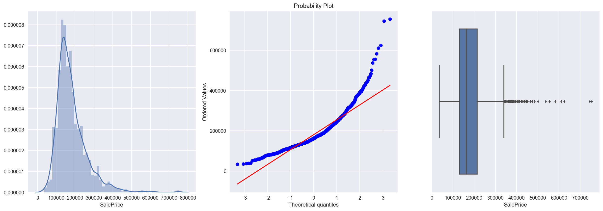
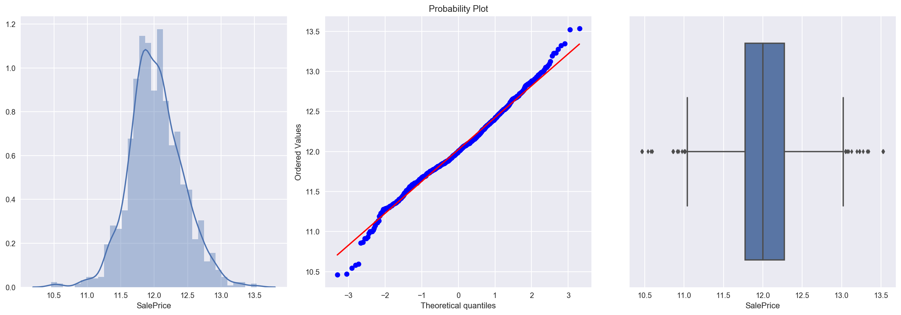
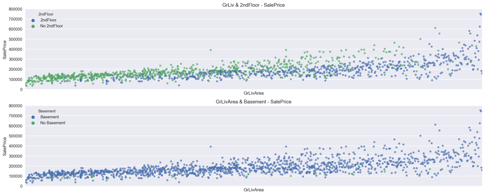
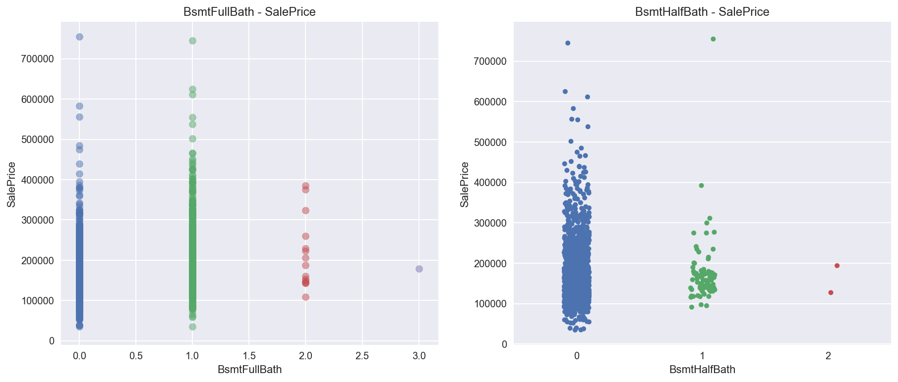
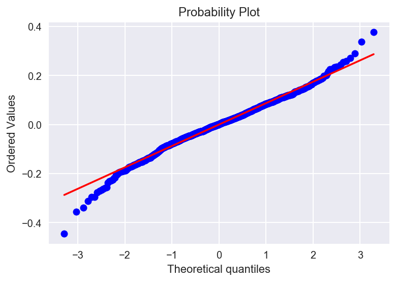

# Project : House Prices: Advanced Regression Techniques
---

## 1. Data Introduce
### 1.1 Purpose :   Predict SalePrice

### 1.2 Data set:
   > - Use house data in Ames. Iowa
   
   > - Train Data : It consists of 81 variables and 1460 house data

   > - Test Data  : It consists of 80 variables and 1459 house data

   > - Total Data : 2919 house data
   > - [Source : House Prices: Advanced Regression Techniques](https://www.kaggle.com/c/house-prices-advanced-regression-techniques "House Prices: Advanced Regression Techniques")

### 1.3 Evaluation
   > - Root-Mean-Squared-Error (RMSE)  

$$
RMSE = \sqrt{\frac{1}{n}\Sigma_{i=1}^{n}{\Big(\frac{d_i -f_i}{\sigma_i}\Big)^2}}
$$


### 2. Exploring the Data 
Let's start with importing the necessary libaries, reading in the data and checking out the dataset.

Note that the last column from this dataset, 'SalePrice' will be our target label. All other columns are features about each individual in house database


```python
# Import libraries necessary for this project
import numpy as np
import pandas as pd
import scipy as sp
from scipy import stats
import statsmodels.api as sm
import statsmodels.formula.api as smf
import statsmodels.stats.api as sms
from scipy.stats import norm, skew 
from statsmodels.stats.outliers_influence import variance_inflation_factor

# Import visualisation libraries
import matplotlib.pyplot as plt
import seaborn as sns

# Pretty display for notebooks
%matplotlib inline

# Allows the use of display() for DataFrames
from IPython.display import display 

# Ignore the warnings
import warnings
warnings.filterwarnings('ignore')

# Load the dataset
train = pd.read_csv("./Input/train.csv")
test = pd.read_csv("./Input/test.csv")

# Success - Display the first record
display(train.head(n=1))
```

    /Users/sunghwanki/anaconda3/lib/python3.6/site-packages/statsmodels/compat/pandas.py:56: FutureWarning: The pandas.core.datetools module is deprecated and will be removed in a future version. Please use the pandas.tseries module instead.
      from pandas.core import datetools


<div>
<style>
    .dataframe thead tr:only-child th {
        text-align: right;
    }

    .dataframe thead th {
        text-align: left;
    }

    .dataframe tbody tr th {
        vertical-align: top;
    }
</style>
<table border="1" class="dataframe">
  <thead>
    <tr style="text-align: right;">
      <th></th>
      <th>Id</th>
      <th>MSSubClass</th>
      <th>MSZoning</th>
      <th>LotFrontage</th>
      <th>LotArea</th>
      <th>Street</th>
      <th>Alley</th>
      <th>LotShape</th>
      <th>LandContour</th>
      <th>Utilities</th>
      <th>...</th>
      <th>PoolArea</th>
      <th>PoolQC</th>
      <th>Fence</th>
      <th>MiscFeature</th>
      <th>MiscVal</th>
      <th>MoSold</th>
      <th>YrSold</th>
      <th>SaleType</th>
      <th>SaleCondition</th>
      <th>SalePrice</th>
    </tr>
  </thead>
  <tbody>
    <tr>
      <th>0</th>
      <td>1</td>
      <td>60</td>
      <td>RL</td>
      <td>65.0</td>
      <td>8450</td>
      <td>Pave</td>
      <td>NaN</td>
      <td>Reg</td>
      <td>Lvl</td>
      <td>AllPub</td>
      <td>...</td>
      <td>0</td>
      <td>NaN</td>
      <td>NaN</td>
      <td>NaN</td>
      <td>0</td>
      <td>2</td>
      <td>2008</td>
      <td>WD</td>
      <td>Normal</td>
      <td>208500</td>
    </tr>
  </tbody>
</table>
<p>1 rows × 81 columns</p>
</div>


#### (1) Check data


```python
print("Train data : ", train.shape)
print("Test  data : ", test.shape)
```

    Train data :  (1460, 81)
    Test  data :  (1459, 80)


#### Comments :
There are 1460 instances of training data and 1460 of test data. Total number of attributes equals 81

#### (2) Status of Train data


```python
train.describe()
```


<div>
<style>
    .dataframe thead tr:only-child th {
        text-align: right;
    }

    .dataframe thead th {
        text-align: left;
    }

    .dataframe tbody tr th {
        vertical-align: top;
    }
</style>
<table border="1" class="dataframe">
  <thead>
    <tr style="text-align: right;">
      <th></th>
      <th>Id</th>
      <th>MSSubClass</th>
      <th>LotFrontage</th>
      <th>LotArea</th>
      <th>OverallQual</th>
      <th>OverallCond</th>
      <th>YearBuilt</th>
      <th>YearRemodAdd</th>
      <th>MasVnrArea</th>
      <th>BsmtFinSF1</th>
      <th>...</th>
      <th>WoodDeckSF</th>
      <th>OpenPorchSF</th>
      <th>EnclosedPorch</th>
      <th>3SsnPorch</th>
      <th>ScreenPorch</th>
      <th>PoolArea</th>
      <th>MiscVal</th>
      <th>MoSold</th>
      <th>YrSold</th>
      <th>SalePrice</th>
    </tr>
  </thead>
  <tbody>
    <tr>
      <th>count</th>
      <td>1460.000000</td>
      <td>1460.000000</td>
      <td>1201.000000</td>
      <td>1460.000000</td>
      <td>1460.000000</td>
      <td>1460.000000</td>
      <td>1460.000000</td>
      <td>1460.000000</td>
      <td>1452.000000</td>
      <td>1460.000000</td>
      <td>...</td>
      <td>1460.000000</td>
      <td>1460.000000</td>
      <td>1460.000000</td>
      <td>1460.000000</td>
      <td>1460.000000</td>
      <td>1460.000000</td>
      <td>1460.000000</td>
      <td>1460.000000</td>
      <td>1460.000000</td>
      <td>1460.000000</td>
    </tr>
    <tr>
      <th>mean</th>
      <td>730.500000</td>
      <td>56.897260</td>
      <td>70.049958</td>
      <td>10516.828082</td>
      <td>6.099315</td>
      <td>5.575342</td>
      <td>1971.267808</td>
      <td>1984.865753</td>
      <td>103.685262</td>
      <td>443.639726</td>
      <td>...</td>
      <td>94.244521</td>
      <td>46.660274</td>
      <td>21.954110</td>
      <td>3.409589</td>
      <td>15.060959</td>
      <td>2.758904</td>
      <td>43.489041</td>
      <td>6.321918</td>
      <td>2007.815753</td>
      <td>180921.195890</td>
    </tr>
    <tr>
      <th>std</th>
      <td>421.610009</td>
      <td>42.300571</td>
      <td>24.284752</td>
      <td>9981.264932</td>
      <td>1.382997</td>
      <td>1.112799</td>
      <td>30.202904</td>
      <td>20.645407</td>
      <td>181.066207</td>
      <td>456.098091</td>
      <td>...</td>
      <td>125.338794</td>
      <td>66.256028</td>
      <td>61.119149</td>
      <td>29.317331</td>
      <td>55.757415</td>
      <td>40.177307</td>
      <td>496.123024</td>
      <td>2.703626</td>
      <td>1.328095</td>
      <td>79442.502883</td>
    </tr>
    <tr>
      <th>min</th>
      <td>1.000000</td>
      <td>20.000000</td>
      <td>21.000000</td>
      <td>1300.000000</td>
      <td>1.000000</td>
      <td>1.000000</td>
      <td>1872.000000</td>
      <td>1950.000000</td>
      <td>0.000000</td>
      <td>0.000000</td>
      <td>...</td>
      <td>0.000000</td>
      <td>0.000000</td>
      <td>0.000000</td>
      <td>0.000000</td>
      <td>0.000000</td>
      <td>0.000000</td>
      <td>0.000000</td>
      <td>1.000000</td>
      <td>2006.000000</td>
      <td>34900.000000</td>
    </tr>
    <tr>
      <th>25%</th>
      <td>365.750000</td>
      <td>20.000000</td>
      <td>59.000000</td>
      <td>7553.500000</td>
      <td>5.000000</td>
      <td>5.000000</td>
      <td>1954.000000</td>
      <td>1967.000000</td>
      <td>0.000000</td>
      <td>0.000000</td>
      <td>...</td>
      <td>0.000000</td>
      <td>0.000000</td>
      <td>0.000000</td>
      <td>0.000000</td>
      <td>0.000000</td>
      <td>0.000000</td>
      <td>0.000000</td>
      <td>5.000000</td>
      <td>2007.000000</td>
      <td>129975.000000</td>
    </tr>
    <tr>
      <th>50%</th>
      <td>730.500000</td>
      <td>50.000000</td>
      <td>69.000000</td>
      <td>9478.500000</td>
      <td>6.000000</td>
      <td>5.000000</td>
      <td>1973.000000</td>
      <td>1994.000000</td>
      <td>0.000000</td>
      <td>383.500000</td>
      <td>...</td>
      <td>0.000000</td>
      <td>25.000000</td>
      <td>0.000000</td>
      <td>0.000000</td>
      <td>0.000000</td>
      <td>0.000000</td>
      <td>0.000000</td>
      <td>6.000000</td>
      <td>2008.000000</td>
      <td>163000.000000</td>
    </tr>
    <tr>
      <th>75%</th>
      <td>1095.250000</td>
      <td>70.000000</td>
      <td>80.000000</td>
      <td>11601.500000</td>
      <td>7.000000</td>
      <td>6.000000</td>
      <td>2000.000000</td>
      <td>2004.000000</td>
      <td>166.000000</td>
      <td>712.250000</td>
      <td>...</td>
      <td>168.000000</td>
      <td>68.000000</td>
      <td>0.000000</td>
      <td>0.000000</td>
      <td>0.000000</td>
      <td>0.000000</td>
      <td>0.000000</td>
      <td>8.000000</td>
      <td>2009.000000</td>
      <td>214000.000000</td>
    </tr>
    <tr>
      <th>max</th>
      <td>1460.000000</td>
      <td>190.000000</td>
      <td>313.000000</td>
      <td>215245.000000</td>
      <td>10.000000</td>
      <td>9.000000</td>
      <td>2010.000000</td>
      <td>2010.000000</td>
      <td>1600.000000</td>
      <td>5644.000000</td>
      <td>...</td>
      <td>857.000000</td>
      <td>547.000000</td>
      <td>552.000000</td>
      <td>508.000000</td>
      <td>480.000000</td>
      <td>738.000000</td>
      <td>15500.000000</td>
      <td>12.000000</td>
      <td>2010.000000</td>
      <td>755000.000000</td>
    </tr>
  </tbody>
</table>
<p>8 rows × 38 columns</p>
</div>


#### Comment :
1. Count :Some data such as LotFrontage and MasVnrArea are lost
2. Mean & 50% : Some data is biased to a certain value

#### (3) Explore SalePrice 


```python
plt.figure(figsize=(17,6))

plt.subplot(131)
sns.distplot(train["SalePrice"])

plt.subplot(132)
stats.probplot(train["SalePrice"], plot=plt)

plt.subplot(133)
sns.boxplot(train["SalePrice"])
plt.tight_layout()
plt.show()

print(train["SalePrice"].describe(),"\n")

print("Skewness: %f" % train['SalePrice'].skew())
print("Kurtosis: %f" % train['SalePrice'].kurt())
```





    count      1460.000000
    mean     180921.195890
    std       79442.502883
    min       34900.000000
    25%      129975.000000
    50%      163000.000000
    75%      214000.000000
    max      755000.000000
    Name: SalePrice, dtype: float64 
    
    Skewness: 1.882876
    Kurtosis: 6.536282


#### Comments :
1. It is apparent that SalePrice doesn't follow normal distribution and has positive skewness.

#### (4) SalePrice log transformation


```python
nomalized_SalePrice = np.log1p(train["SalePrice"])

plt.figure(figsize=(17,6))

plt.subplot(131)
sns.distplot(nomalized_SalePrice)

plt.subplot(132)
stats.probplot(nomalized_SalePrice, plot=plt)

plt.subplot(133)
sns.boxplot(nomalized_SalePrice)
plt.tight_layout()
plt.show()
```





#### Comment:
1. After log transformation, it seems to follow normal distribution.

### 2-2 Feature Type

#### (1) Check Numerical and Catergorical variables


```python
# Because the MSSubClass variable is a category value, change numeric data to character data
train["MSSubClass"] = train["MSSubClass"].astype('str')
```


```python
# Divide into numeric and categorical variables
numerical_features = []
categorical_features = []
for f in train.columns:
    if train.dtypes[f] != 'object':
        numerical_features.append(f)
    else:
        categorical_features.append(f)
```


```python
print("Numerical Features Qty :", len(numerical_features),"\n")
print("Numerical Features : ", numerical_features, "\n\n")
print("Categorical Features Qty :", len(categorical_features),"\n")
print("Categorical Features :", categorical_features)
```

    Numerical Features Qty : 37 
    
    Numerical Features :  ['Id', 'LotFrontage', 'LotArea', 'OverallQual', 'OverallCond', 'YearBuilt', 'YearRemodAdd', 'MasVnrArea', 'BsmtFinSF1', 'BsmtFinSF2', 'BsmtUnfSF', 'TotalBsmtSF', '1stFlrSF', '2ndFlrSF', 'LowQualFinSF', 'GrLivArea', 'BsmtFullBath', 'BsmtHalfBath', 'FullBath', 'HalfBath', 'BedroomAbvGr', 'KitchenAbvGr', 'TotRmsAbvGrd', 'Fireplaces', 'GarageYrBlt', 'GarageCars', 'GarageArea', 'WoodDeckSF', 'OpenPorchSF', 'EnclosedPorch', '3SsnPorch', 'ScreenPorch', 'PoolArea', 'MiscVal', 'MoSold', 'YrSold', 'SalePrice'] 
    
    
    Categorical Features Qty : 44 
    
    Categorical Features : ['MSSubClass', 'MSZoning', 'Street', 'Alley', 'LotShape', 'LandContour', 'Utilities', 'LotConfig', 'LandSlope', 'Neighborhood', 'Condition1', 'Condition2', 'BldgType', 'HouseStyle', 'RoofStyle', 'RoofMatl', 'Exterior1st', 'Exterior2nd', 'MasVnrType', 'ExterQual', 'ExterCond', 'Foundation', 'BsmtQual', 'BsmtCond', 'BsmtExposure', 'BsmtFinType1', 'BsmtFinType2', 'Heating', 'HeatingQC', 'CentralAir', 'Electrical', 'KitchenQual', 'Functional', 'FireplaceQu', 'GarageType', 'GarageFinish', 'GarageQual', 'GarageCond', 'PavedDrive', 'PoolQC', 'Fence', 'MiscFeature', 'SaleType', 'SaleCondition']


#### (2) Graph for numerical features with  SalePrice
It also would be useful to see how sale price compares to each independent variable.


```python
fig, ax = plt.subplots(6,6, figsize = (20,20))

for idx, n in enumerate(numerical_features):
    if n == 'SalePrice':
        continue
    sns.regplot(x=n, y='SalePrice', data=train, ax = ax[idx//6,idx%6])
    ax[idx//6, idx % 6].set(yticklabels=[])
    ax[idx//6, idx % 6].set(xticklabels=[])
    
    continue   
```


#### (3) Graph for categorical features with  SalePrice


```python
fig, ax = plt.subplots(8,6, figsize = (20,20))

for idx, n in enumerate(categorical_features):
    
    sns.countplot(x=n, data=train, ax = ax[idx//6, idx % 6])
    ax[idx//6, idx % 6].set(yticklabels=[])
    
    continue   
```


### 2-3 Relationship between SalePrice and variables

#### 2-3-1 Area


```python
# Make df_train set to check 2ndFloor and Basement
df_train = train.copy()
df_train["2ndFloor"] = "2ndFloor"
df_train["2ndFloor"].loc[df_train["2ndFlrSF"]==0] = "No 2ndFloor"
df_train["Basement"] = "Basement"
df_train["Basement"].loc[df_train["TotalBsmtSF"]==0] = "No Basement"
```


```python
# Joint plot GrLivArea/saleprice
grid = sns.jointplot(x = "GrLivArea", y = "SalePrice", data=train, kind="reg")
grid.fig.set_size_inches(15,5)

# Strip plot GrLivArea/2ndFloor/saleprice
plt.figure(figsize = (20,8))
plt.subplot(211)
g = sns.stripplot(x = "GrLivArea", y = 'SalePrice', hue = "2ndFloor", data = df_train, alpha = 0.7)
g.set_xlabel('GrLivArea')
g.set_ylabel('SalePrice')
g.set_xticks([])
g.set_title('GrLiv & 2ndFloor - SalePrice')

# Strip plot GrLivArea/Basement/saleprice
plt.subplot(212)
b = sns.stripplot( x = "GrLivArea", y = 'SalePrice', hue = "Basement", data = df_train, alpha = 0.7)
b.set_xlabel('GrLivArea')
b.set_ylabel('SalePrice')
b.set_title('GrLivArea & Basement - SalePrice')
b.set_xticks([])

plt.show()
```





#### Comments : 
1.GrLivArea is a linear relationship to house values and is heterogeneous.

2.If the house price is above $ 200,000, there are more houses on the second floor and a few houses without basement

#### 2-3-2 Overall


```python
# Graph for GrLivArea & OverallQual - SalePrice
plt.figure(figsize=(15,8))
ax1 = plt.subplot2grid((2,2), (0,0), colspan = 2)
for qual in range(1,11):
    index = train.OverallQual == qual
    ax1.scatter(train.GrLivArea.loc[index], train.SalePrice.loc[index], data=train, label= qual, alpha =0.5)
ax1.legend(loc = 0)
ax1.set_title("GrLivArea & OverallQual - SalePrice")
ax1.set_xlabel('GrLivArea & OverallQual')
ax1.set_ylabel('SalePrice')

# Graph for OverallQual - SalePrice
ax2 = plt.subplot2grid((2,2), (1,0))
sns.boxplot(x = "OverallQual", y = "SalePrice", data=train, ax= ax2)
ax2.set_title('OverallQual - SalePrice')

# Graph for OverallCond - SalePrice
ax3 = plt.subplot2grid((2,2), (1,1))
sns.boxplot(x = "OverallCond", y = "SalePrice", data=train, ax= ax3)
ax3.set_title('OverallCond - SalePrice')
```


    Text(0.5,1,'OverallCond - SalePrice')


#### Comments :

1. 'OverallQual' seem to be related with 'SalePrice' and the box plot shows how sales prices increase with the overall quality. however, the 'OverallCond' seem to be not related.

#### 2-3-3 Garage


```python
# Graph for GarageArea & GarageCars - SalePrice
plt.figure(figsize=(15,6))

ax1 = plt.subplot(1,2,1)
for car in range(0,5):
    index = train.GarageCars == car
    ax1.scatter(x = train.GarageArea.loc[index], y = train.SalePrice.loc[index], data=train, label=car, alpha='0.5')

# Graph for GarageArea 
ax1.legend()
ax1.set_title('GarageArea - SalePrice')
ax1.set_xlabel('GarageArea')
ax1.set_ylabel('SalePrice')

# Graph for GarageCars
ax2 = plt.subplot(1,2,2)
sns.stripplot(x = "GarageCars", y = "SalePrice", data=train,ax=ax2, jitter=True)
ax2.set_title('GarageCars - SalePrice')
ax2.legend()

plt.show()
```


#### Comments:
1. The wider the GarageArea and the larger the number of cars (GarageCars), it can be seen that the higher the house price

#### 2-3-4 Neighborhood


```python
# Neighborhood variables are grouped by neighbors and then aggregated by average
Neighbor = train.pivot_table(index="Neighborhood",values="SalePrice", aggfunc='mean').sort_values(by = ["SalePrice"], ascending = False)
Neighbor = Neighbor.reset_index()

# The bar graph displays the aggregated data in the order of the highest to lowest price
g = sns.factorplot(x = "Neighborhood", y="SalePrice", data=Neighbor, size =8, kind="bar")
g.set_xticklabels(rotation=45)
g.fig.set_size_inches(15,5)
plt.show()
```


```python
# High_price_neighbor is the house value of more than 250,000, Middle_price_neighbor is the neighbor of 250,000 ~ 150,000, and Low_price_neighbor is the remaining neighbor
def neighbor_level(x):
    High_price_neighbor = ['NoRidge','NridgHt','StoneBr'] 
    Middle_price_neighbor = ['Timber','Somerst','Veenker','ClearCr','Crawfor','NWAmes', 'Gilbert','Blmngtn', 'SWISU','Mitchel','CollgCr']
    Low_price_neighbor = ['IDOTRR','Blueste', 'Sawyer','NAmes', 'BrDale', 'OldTown','MeadowV', 'NPkVill','BrkSide','Edwards']
    
    if str(x) in High_price_neighbor:
        return "high"
    elif str(x) in Middle_price_neighbor:
        return "middle"
    elif str(x) in Low_price_neighbor:
        return "low"
    
df_train["neighbor_level"] = df_train["Neighborhood"].apply(neighbor_level)
```


```python
fig, ax = plt.subplots(5,8, figsize = (20,20))

for idx, n in enumerate(numerical_features):

    sns.barplot(x="neighbor_level", y= n, data=df_train, ax = ax[idx//8,idx%8], order=['high', 'middle', 'low'])
    ax[idx//8, idx % 8].set(yticklabels=[])
    ax[idx//8, idx % 8].set_xlabel("")
    ax[idx//8, idx % 8].set_ylabel(n)
    continue  
```


#### Comments:
1. High group's Overall quality (overall quality), GrLivArea (living room size), and GargeArea (garage width) are high on the average, which is an important factor in predicting house prices

#### 2-3-4 Year


```python
# Correlation between YearBuilt and SalePrice
# Boxplot YearBuilt / SalePrice
plt.figure(figsize=(15,6))
fig = sns.boxplot(x="YearBuilt", y="SalePrice", data=train)
fig.axis(ymin=0, ymax=800000)
plt.xticks(rotation=90)
plt.show()

# Stripplot YearRemodAdd / YearBuilt
plt.figure(figsize=(15,6))
ax2 = plt.subplot(1,2,1)
sns.stripplot(x = train['YearBuilt'], y = train['YearRemodAdd'], alpha = 0.5,ax=ax2)
ax2.set_xticks([])
plt.xlabel('YearBuilt')
plt.ylabel('YearRemodAdd')

# Countplot YrSold 
ax3 = plt.subplot(1,2,2)
sns.countplot(x = train['YrSold'], alpha = 0.5, ax=ax3)
plt.show()

# Stripplot YearBuilt / OverallQual
plt.figure(figsize=(15,6))
ax4 = plt.subplot2grid((2,2), (0,0), colspan = 2)
sns.stripplot(x = train['YearBuilt'], y = train['OverallQual'], alpha = 0.5,ax=ax4)

ax4.set_xticks([])
plt.xlabel('YearBuilt')
plt.ylabel('OverallQual')

# Countplot MoSold  
ax5 = plt.subplot2grid((2,2), (1,0), colspan = 2)
sns.countplot(x = "MoSold", data=train, ax = ax5)
plt.show()
```


#### Comments :

1. The price of recently built house is high.
2. Houses that have not been remodeled are recorded in the same year as the year they were built.
3. Remodeling took place after 1950 and most of the old houses were remodeled in 1950.
4. The year of the sale is from 2006 to 2010, with the largest sale in 2009.
5. The most active trading takes place in May, June, and July.

### 2-3-5 Fireplaces


```python
# Stripplot Fireplaces / SalePrice
plt.figure(figsize=(15,10))
ax1 = plt.subplot2grid((2,2), (0,0), colspan = 2)
sns.stripplot(x = train['Fireplaces'], y = train['SalePrice'], alpha = 0.5, jitter = True, ax=ax1)

# Countplot FireplaceQu 
ax2 = plt.subplot2grid((2,2), (1,0))
sns.countplot(x = "FireplaceQu", data=train, ax = ax2, order = ['Ex', 'Gd', 'TA', 'Fa', 'Po'])

# Boxplot FireplaceQu / OverallQual
ax3 = plt.subplot2grid((2,2), (1,1))
sns.boxplot(x = 'FireplaceQu', y = 'OverallQual', data = train, order = ['Ex', 'Gd', 'TA', 'Fa', 'Po'], ax=ax3)
plt.show()

# Stripplot FireplaceQu / Fireplaces / SalePrice
plt.figure(figsize=(15,10))
ax4 = plt.subplot(2,1,1)
sns.stripplot(x='FireplaceQu', y='SalePrice', hue='Fireplaces', data=train, jitter=True, alpha=0.6,order = ['Ex', 'Gd', 'TA', 'Fa', 'Po'], ax=ax4)

plt.show()
```


#### Comments:

1. There is a price difference between a house with zero FirePlaces and a house with one FirePlaces.
2. FireplaceQu and OverallQual are closely related.
3. The lower the FireplaceQu, the lower the SalePrice

### 2-3-6 Basement Bath


```python
# Stripplot BsmtQual / SalePrice
plt.figure(figsize=(15,6))
sns.stripplot(x = "BsmtQual", y = "SalePrice", data=train, jitter=True,\
             order = ['Ex', 'Gd', 'TA', 'Fa'])

plt.figure(figsize=(15,6))

# Scatterplot BsmtFullBath
ax1 = plt.subplot(1,2,1)
for BSMT in range(0,5):
    index = train.BsmtFullBath == BSMT
    ax1.scatter(x = train.BsmtFullBath.loc[index], y = train.SalePrice.loc[index], data=train, label=BSMT, alpha='0.5')

# ax1.legend()
ax1.set_title('BsmtFullBath - SalePrice')
ax1.set_xlabel('BsmtFullBath')
ax1.set_ylabel('SalePrice')

# Stripplot BsmtHalfBath / SalePrice
ax2 = plt.subplot(1,2,2)
sns.stripplot(x = "BsmtHalfBath", y = "SalePrice", data=train,ax=ax2, jitter=True)
ax2.set_title('BsmtHalfBath - SalePrice')


plt.show()
```





#### Comment :
1. The higher the quality of the bathroom, the higher the house price.
2. In the case of HalfBath, the more the house price goes down

### 2-3-7 Room


```python
# Stripplot TotRmsAbvGrd / SalePrice
plt.figure(figsize=(15,8))
ax1 = plt.subplot(2,1,1)
sns.stripplot(x='TotRmsAbvGrd', y='SalePrice', hue='TotRmsAbvGrd', data=train, jitter=True, alpha=0.6, ax=ax1)

# Countplot TotRmsAbvGrd
ax2 = plt.subplot2grid((2,2), (1,0))
sns.countplot(x = "TotRmsAbvGrd", data=train , ax = ax2, order = train["TotRmsAbvGrd"].value_counts().index)

# Boxplot TotRmsAbvGrd / OverallQual
ax3 = plt.subplot2grid((2,2), (1,1))
sns.boxplot(x = 'TotRmsAbvGrd', y = 'OverallQual', data = train, ax=ax3)
plt.show()

# Jointplot TotRmsAbvGrd / SalePrice
grid = sns.jointplot(x = "TotRmsAbvGrd", y = "SalePrice", data=train, kind="reg", size = 8)
grid.fig.set_size_inches(15,5)
```


#### Comment :

1. The higher the number of rooms (TotRmsAbvGrd), the higher the house prices tend to be.
2. The better the room, the better the quality of the house.

### 3. Feature Engineering

### 3-1 Missing Values

#### 3-1-1 Join Train and Test set
Combine Train and Test data and process missing data at once


```python
# Save lenth of train and test set
ntrain = train.shape[0]
ntest = test.shape[0]

# Combine Train and Test data 
all_data = pd.concat((train, test)).reset_index(drop=True)
print("All data size is {}".format(all_data.shape))
```

    All data size is (2919, 81)


#### 3-1-2 Statuse of missing values


```python
# To maintain the independence of all_data, copy it to all_data_cp and proceed with it
all_data_cp = all_data.copy()

# Drop saleprice column 
all_data_cp.drop(['SalePrice'], axis=1, inplace=True)


# Chck missing values 
all_data_null = all_data_cp.isnull().sum()
all_data_null = all_data_null.drop(all_data_null[all_data_null == 0].index).sort_values(ascending=False)
all_data_missing = pd.DataFrame({'Missing Numbers' :all_data_null})
all_data_null =  all_data_null / len(all_data_cp)*100

# Barplot missing values
f, ax = plt.subplots(figsize=(15, 12))
plt.xticks(rotation='90')
sns.barplot(x=all_data_null.index, y=all_data_null)
plt.xlabel('Features', fontsize=15)
plt.ylabel('Percent of missing values', fontsize=15)
plt.title('Percent missing data by feature', fontsize=15)

print("Variables with Missing Qty : " , all_data_missing.count().values)
print("Total Missing values Qty : " , all_data_missing.sum().values)
```

    Variables with Missing Qty :  [34]
    Total Missing values Qty :  [13965]


34 attributes have missing values. Most of times NA means lack of subject described by attribute, like missing pool, fence, no garage and basement.

#### 3-1-3 Missing Values processing

MSSubClass

 - Description : Identifies the type of dwelling involved in the sale
 - Process : Missing values are filled with None because the data is evenly distributed and hard to judge by specific value


```python
all_data['MSSubClass'] = all_data['MSSubClass'].fillna("None")
```

SaleType
 - Description: Type of sale   
 - Process : 87% of data uses WD (Warranty Deed - Conventional) method, so Missing Data is filled with WD


```python
all_data['SaleType'] = all_data['SaleType'].fillna(all_data['SaleType'].mode()[0])
```

KitchenQual:
 - Description : Kitchen quality
 - Process : 52% of the total data is classified as TA (Typical / Average), so Missing Data is filled with TA


```python
all_data['KitchenQual'] = all_data['KitchenQual'].fillna(all_data['KitchenQual'].mode()[0])
```

BsmtFinSF1 & BsmtFinSF2

 - Description : Finished basement square feet
 - Process : In both data, about 35% of the data is zero. Therefore, Missing Data is also filled with 0.


```python
all_data['BsmtFinSF1'] = all_data['BsmtFinSF1'].fillna(0)
all_data['BsmtFinSF2'] = all_data['BsmtFinSF2'].fillna(0)
```

GarageCars  &  GarageArea & GarageYrBlt

 - Description : Qty, Size, year of garage 
 - Process : Missing data means that there is no garage, so filling Missing Data with 0


```python
all_data['GarageCars'] = all_data['GarageCars'].fillna(0)
all_data['GarageArea'] = all_data['GarageArea'].fillna(0)
all_data['GarageYrBlt'] = all_data['GarageYrBlt'].fillna(0)
```

TotalBsmtSF

 - Description : Total square feet of basement area
 - Process : Missing data means that there is no basement, so filling Missing Data with 0


```python
all_data['TotalBsmtSF'] = all_data['TotalBsmtSF'].fillna(0)
```

BsmtUnfSF

 - Description : Unfinished square feet of basement area
 - Process : Missing data means that there is no basement, so filling Missing Data with 0


```python
all_data['BsmtUnfSF'] = all_data['BsmtUnfSF'].fillna(0)
```

BsmtQual & BsmtCond

 - Description : Evaluates the height and condition of the basement
 - Process : Missing values in BsmtQual and BsmtCond data are converted to None because there is no basement


```python
all_data['BsmtQual']=all_data['BsmtQual'].fillna('None')
all_data['BsmtCond']=all_data['BsmtCond'].fillna('None')
```

BsmtExposure & BsmtFinType1 & BsmtFinType2

 - Description : Refers to walkout or garden level walls and Rating of basement finished area
 - Process : In this case, the missing values are a house without a basement.


```python
all_data['BsmtExposure']=all_data['BsmtExposure'].fillna('None')
all_data['BsmtFinType1']=all_data['BsmtFinType1'].fillna('None')
all_data['BsmtFinType2']=all_data['BsmtFinType2'].fillna('None')
```

BsmtFullBath & BsmtHalfBath

 - Description : Basement full and half bathrooms 
 - Process : Missing values mean there is no bath so fill them with 0


```python
all_data['BsmtHalfBath'] = all_data['BsmtHalfBath'].fillna(0)
all_data['BsmtFullBath'] = all_data['BsmtFullBath'].fillna(0)
```

Electrical

 - Description : Electrical system
 - Process : Approximately 92% of the data is SBrkr. Fill Missing Data with mode value(SBrkr)


```python
all_data['Electrical'] = all_data['Electrical'].fillna(all_data['Electrical'].mode()[0])
```

Utilities

 - Description : Type of utilities available
 - Process : Since 100% of the test data is composed of AllPub, it is judged that there is no big meaning. So drop the column out


```python
all_data.drop(['Utilities'], axis=1, inplace=True)
```

MSZoning

 - Description : Identifies the general zoning classification of the sale
 - Process : More than 78% of the data is made up of RL, so the missing values are processed using the mode value.


```python
all_data['MSZoning']=all_data['MSZoning'].fillna(all_data['MSZoning'].mode()[0])
```

MasVnrArea

 - Description : Masonry veneer area in square feet
 - Process : About 60% of the data is 0, and it is thought that it is not decorated.


```python
all_data['MasVnrArea']=all_data['MasVnrArea'].fillna(0)
```

MasVnrType

 - Description : Masonry veneer type 
 - Process : Approximately 60% of the data is missing, meaning that it is not decorated.


```python
all_data['MasVnrType']=all_data['MasVnrType'].fillna('None')
```

GarageType

 - Description : Garage location
 - Process : Attchd, Detchd, BuiltIn, Basment, 2Types, CarPort There are 6 categories, where missing value represents the house without garage and converts it to None value.


```python
all_data['GarageType']=all_data['GarageType'].fillna('None')
```

GarageYrBlt

 - Description : Year garage was built
 - Process : Since the garage construction year is usually the same as the construction year, the Nan value is to be filled with the construction year


```python
all_data['GarageYrBlt'][all_data['GarageYrBlt']>2150]
all_data['GarageYrBlt']=all_data['GarageYrBlt'].fillna(all_data['YearBuilt'][ all_data['GarageYrBlt'].isnull()])
```

GarageFinish, GarageCond, GarageQual

 - Description : Garage Quality Related Categories
 - Process : Features are all similar data and have the same number of missing values. Missing values are those without garage and are treated as None values.


```python
all_data['GarageFinish']=all_data['GarageFinish'].fillna('None')
all_data['GarageCond']=all_data['GarageCond'].fillna('None')
all_data['GarageQual']=all_data['GarageQual'].fillna('None')
```

LotFrontage

 - Description : Linear feet of street connected to property
 - Process : Group the Neighborhood and treat it as a median in the same Neighborhood


```python
all_data["LotFrontage"] = all_data.groupby("Neighborhood")["LotFrontage"].transform(lambda x: x.fillna(x.median()))
```

FireplaceQu

 - Description : Fireplace quality
 - Process : Missing value indicates that there is no fireplace and it is converted to None value.


```python
all_data['FireplaceQu']=all_data['FireplaceQu'].fillna('None')
```

Fence

 - Description : Fence quality
 - Process : Missing values are fence-less, and convert to None


```python
all_data['Fence']=all_data['Fence'].fillna('None')
```

Alley

 - Description : Type of alley access to property
 - Process : Grvl, and Pave. The missing values indicate that there are no adjacent alleys, and are converted to None values


```python
all_data['Alley']=all_data['Alley'].fillna('None')
```

Functional

 - Description : Home functionality (Assume typical unless deductions are warranted)

 - Process : Since more than 93% of the total data is in the Typ format, the missing values are expected to be included in these functions


```python
all_data['Functional']= all_data["Functional"].fillna("Typ")
```

MiscFeature 

 - Description : Miscellaneous feature not covered in other categories
 - Process : The missing values are houses that do not contain these features, so replace them with none


```python
all_data['MiscFeature']=all_data['MiscFeature'].fillna('None')
```

PoolQC

 - Description : Pool quality
 - Process : The missing values are houses that do not contain a pool, so replace them with none


```python
all_data['PoolQC']=all_data['PoolQC'].fillna('None')
```

Exterior1st & Exterior2nd

 - Description : Exterior covering on house
 - 처리 방법 : 대부분의 외장재가 VinylSd로 되어있어 VinylSd로 예측 nan값을 mode로 채워줌


```python
all_data['Exterior1st'] = all_data['Exterior1st'].fillna(all_data['Exterior1st'].mode()[0])
all_data['Exterior2nd'] = all_data['Exterior2nd'].fillna(all_data['Exterior2nd'].mode()[0])
```

### 3-2 Feature Correlation

#### 3-2-1 Numerical Features
To explore the features, we will use Correlation matrix (heatmap style). 


```python
corrmat = train.corr()
f, ax = plt.subplots(figsize = (15,9))
sns.heatmap(corrmat, vmax = 1, square=True)
```


    <matplotlib.axes._subplots.AxesSubplot at 0x1c2bdaa6d8>


This heatmap is the best way to get a quick overview of features relationships. At first sight, there are two red colored squares that get my attention. The first one refers to the 'TotalBsmtSF' and '1stFlrSF' variables, and the second one refers to the 'GarageX' variables. Both cases show how significant the correlation is between these variables. Actually, this correlation is so strong that it can indicate a situation of multicollinearity. If we think about these variables, we can conclude that they give almost the same information so multicollinearity really occurs.

'SalePrice' correlation matrix (High rank 15)


```python
# 'SalePrice correlation (High rank 15)
# k is number of variables 
k = 15

cor_numerical_cols = corrmat.nlargest(k, 'SalePrice')['SalePrice'].index 
print("Numerical Features Qty :" ,len(cor_numerical_cols), "\n")
print("Numerical Features     : \n",list(cor_numerical_cols))
```

    Numerical Features Qty : 15 
    
    Numerical Features     : 
     ['SalePrice', 'OverallQual', 'GrLivArea', 'GarageCars', 'GarageArea', 'TotalBsmtSF', '1stFlrSF', 'FullBath', 'TotRmsAbvGrd', 'YearBuilt', 'YearRemodAdd', 'GarageYrBlt', 'MasVnrArea', 'Fireplaces', 'BsmtFinSF1']


#### Comments :

1. There are many strong correlations between SalePrice and variables.  OverallQual and GrLivArea are strongly correlated with SalePrice.

#### 3-2-2 Categorical Features


```python
# Select categorical features from train set
train_cat = train[categorical_features]
y_train_d = train['SalePrice']

# Dummy of category data
train_cat_dummies = pd.get_dummies(train_cat)

# Concatenate dummied categorical data with SalePrice
train_cat = pd.concat([y_train_d, train_cat_dummies], axis=1)
corrmat2 = train_cat.corr()

# High correlation coefficient 10
k = 10

cor_categorical_cols = corrmat2.nlargest(k, 'SalePrice')['SalePrice'].index 
cor_categorical_cols
```


    Index(['SalePrice', 'BsmtQual_Ex', 'KitchenQual_Ex', 'Foundation_PConc',
           'ExterQual_Gd', 'ExterQual_Ex', 'BsmtFinType1_GLQ', 'HeatingQC_Ex',
           'GarageFinish_Fin', 'Neighborhood_NridgHt'],
          dtype='object')


### 3-3 Determination of outliers and variables using OLS model
#### OLS (Ordinary least squares ) :  
OLS is a method for estimating the unknown parameters in a linear regression model. OLS chooses the parameters of a linear function of a set of explanatory variables by minimizing the sum of the squares of the differences between the observed dependent variable (values of the variable being predicted) in the given dataset and those predicted by the linear function. 

#### 3-3-1 Model by all numerical Features


```python
# Prepare train and test set
train = all_data[:ntrain]
test = all_data[ntrain:]

# Add_constant 
train = sm.add_constant(train)
train.tail()
```


<div>
<style>
    .dataframe thead tr:only-child th {
        text-align: right;
    }

    .dataframe thead th {
        text-align: left;
    }

    .dataframe tbody tr th {
        vertical-align: top;
    }
</style>
<table border="1" class="dataframe">
  <thead>
    <tr style="text-align: right;">
      <th></th>
      <th>const</th>
      <th>1stFlrSF</th>
      <th>2ndFlrSF</th>
      <th>3SsnPorch</th>
      <th>Alley</th>
      <th>BedroomAbvGr</th>
      <th>BldgType</th>
      <th>BsmtCond</th>
      <th>BsmtExposure</th>
      <th>BsmtFinSF1</th>
      <th>...</th>
      <th>SalePrice</th>
      <th>SaleType</th>
      <th>ScreenPorch</th>
      <th>Street</th>
      <th>TotRmsAbvGrd</th>
      <th>TotalBsmtSF</th>
      <th>WoodDeckSF</th>
      <th>YearBuilt</th>
      <th>YearRemodAdd</th>
      <th>YrSold</th>
    </tr>
  </thead>
  <tbody>
    <tr>
      <th>1455</th>
      <td>1.0</td>
      <td>953</td>
      <td>694</td>
      <td>0</td>
      <td>None</td>
      <td>3</td>
      <td>1Fam</td>
      <td>TA</td>
      <td>No</td>
      <td>0.0</td>
      <td>...</td>
      <td>175000.0</td>
      <td>WD</td>
      <td>0</td>
      <td>Pave</td>
      <td>7</td>
      <td>953.0</td>
      <td>0</td>
      <td>1999</td>
      <td>2000</td>
      <td>2007</td>
    </tr>
    <tr>
      <th>1456</th>
      <td>1.0</td>
      <td>2073</td>
      <td>0</td>
      <td>0</td>
      <td>None</td>
      <td>3</td>
      <td>1Fam</td>
      <td>TA</td>
      <td>No</td>
      <td>790.0</td>
      <td>...</td>
      <td>210000.0</td>
      <td>WD</td>
      <td>0</td>
      <td>Pave</td>
      <td>7</td>
      <td>1542.0</td>
      <td>349</td>
      <td>1978</td>
      <td>1988</td>
      <td>2010</td>
    </tr>
    <tr>
      <th>1457</th>
      <td>1.0</td>
      <td>1188</td>
      <td>1152</td>
      <td>0</td>
      <td>None</td>
      <td>4</td>
      <td>1Fam</td>
      <td>Gd</td>
      <td>No</td>
      <td>275.0</td>
      <td>...</td>
      <td>266500.0</td>
      <td>WD</td>
      <td>0</td>
      <td>Pave</td>
      <td>9</td>
      <td>1152.0</td>
      <td>0</td>
      <td>1941</td>
      <td>2006</td>
      <td>2010</td>
    </tr>
    <tr>
      <th>1458</th>
      <td>1.0</td>
      <td>1078</td>
      <td>0</td>
      <td>0</td>
      <td>None</td>
      <td>2</td>
      <td>1Fam</td>
      <td>TA</td>
      <td>Mn</td>
      <td>49.0</td>
      <td>...</td>
      <td>142125.0</td>
      <td>WD</td>
      <td>0</td>
      <td>Pave</td>
      <td>5</td>
      <td>1078.0</td>
      <td>366</td>
      <td>1950</td>
      <td>1996</td>
      <td>2010</td>
    </tr>
    <tr>
      <th>1459</th>
      <td>1.0</td>
      <td>1256</td>
      <td>0</td>
      <td>0</td>
      <td>None</td>
      <td>3</td>
      <td>1Fam</td>
      <td>TA</td>
      <td>No</td>
      <td>830.0</td>
      <td>...</td>
      <td>147500.0</td>
      <td>WD</td>
      <td>0</td>
      <td>Pave</td>
      <td>6</td>
      <td>1256.0</td>
      <td>736</td>
      <td>1965</td>
      <td>1965</td>
      <td>2008</td>
    </tr>
  </tbody>
</table>
<p>5 rows × 81 columns</p>
</div>


```python
# Create train data with numerical features
train_n = train[numerical_features]

# Drop Id and SalePrice of data with numerical features
train_n = train_n.drop(['Id', 'SalePrice'], axis=1)

# Normalization by applying log to SalePrice
y_train_l = np.log1p(y_train_d)
```


```python
# Apply to OLS model and save as model1_1
model1_1 = sm.OLS(y_train_l, train_n)
result1_1 = model1_1.fit()
```

#### 3-3-2 Model by all categorical Features


```python
# Excludes Utilities
categorical_features = ['MSSubClass', 'MSZoning', 'Street', 'Alley', 'LotShape', 'LandContour', 'LotConfig', 'LandSlope', 'Neighborhood', 'Condition1', 'Condition2', 'BldgType', 'HouseStyle', 'RoofStyle', 'RoofMatl', 'Exterior1st', 'Exterior2nd', 'MasVnrType', 'ExterQual', 'ExterCond', 'Foundation', 'BsmtQual', 'BsmtCond', 'BsmtExposure', 'BsmtFinType1', 'BsmtFinType2', 'Heating', 'HeatingQC', 'CentralAir', 'Electrical', 'KitchenQual', 'Functional', 'FireplaceQu', 'GarageType', 'GarageFinish', 'GarageQual', 'GarageCond', 'PavedDrive', 'PoolQC', 'Fence', 'MiscFeature', 'SaleType', 'SaleCondition']

# Convert data from categorical features into dummies
train_c = pd.get_dummies(train[categorical_features])
train_c.tail()
```


<div>
<style>
    .dataframe thead tr:only-child th {
        text-align: right;
    }

    .dataframe thead th {
        text-align: left;
    }

    .dataframe tbody tr th {
        vertical-align: top;
    }
</style>
<table border="1" class="dataframe">
  <thead>
    <tr style="text-align: right;">
      <th></th>
      <th>MSSubClass_120</th>
      <th>MSSubClass_160</th>
      <th>MSSubClass_180</th>
      <th>MSSubClass_190</th>
      <th>MSSubClass_20</th>
      <th>MSSubClass_30</th>
      <th>MSSubClass_40</th>
      <th>MSSubClass_45</th>
      <th>MSSubClass_50</th>
      <th>MSSubClass_60</th>
      <th>...</th>
      <th>SaleType_ConLw</th>
      <th>SaleType_New</th>
      <th>SaleType_Oth</th>
      <th>SaleType_WD</th>
      <th>SaleCondition_Abnorml</th>
      <th>SaleCondition_AdjLand</th>
      <th>SaleCondition_Alloca</th>
      <th>SaleCondition_Family</th>
      <th>SaleCondition_Normal</th>
      <th>SaleCondition_Partial</th>
    </tr>
  </thead>
  <tbody>
    <tr>
      <th>1455</th>
      <td>0</td>
      <td>0</td>
      <td>0</td>
      <td>0</td>
      <td>0</td>
      <td>0</td>
      <td>0</td>
      <td>0</td>
      <td>0</td>
      <td>1</td>
      <td>...</td>
      <td>0</td>
      <td>0</td>
      <td>0</td>
      <td>1</td>
      <td>0</td>
      <td>0</td>
      <td>0</td>
      <td>0</td>
      <td>1</td>
      <td>0</td>
    </tr>
    <tr>
      <th>1456</th>
      <td>0</td>
      <td>0</td>
      <td>0</td>
      <td>0</td>
      <td>1</td>
      <td>0</td>
      <td>0</td>
      <td>0</td>
      <td>0</td>
      <td>0</td>
      <td>...</td>
      <td>0</td>
      <td>0</td>
      <td>0</td>
      <td>1</td>
      <td>0</td>
      <td>0</td>
      <td>0</td>
      <td>0</td>
      <td>1</td>
      <td>0</td>
    </tr>
    <tr>
      <th>1457</th>
      <td>0</td>
      <td>0</td>
      <td>0</td>
      <td>0</td>
      <td>0</td>
      <td>0</td>
      <td>0</td>
      <td>0</td>
      <td>0</td>
      <td>0</td>
      <td>...</td>
      <td>0</td>
      <td>0</td>
      <td>0</td>
      <td>1</td>
      <td>0</td>
      <td>0</td>
      <td>0</td>
      <td>0</td>
      <td>1</td>
      <td>0</td>
    </tr>
    <tr>
      <th>1458</th>
      <td>0</td>
      <td>0</td>
      <td>0</td>
      <td>0</td>
      <td>1</td>
      <td>0</td>
      <td>0</td>
      <td>0</td>
      <td>0</td>
      <td>0</td>
      <td>...</td>
      <td>0</td>
      <td>0</td>
      <td>0</td>
      <td>1</td>
      <td>0</td>
      <td>0</td>
      <td>0</td>
      <td>0</td>
      <td>1</td>
      <td>0</td>
    </tr>
    <tr>
      <th>1459</th>
      <td>0</td>
      <td>0</td>
      <td>0</td>
      <td>0</td>
      <td>1</td>
      <td>0</td>
      <td>0</td>
      <td>0</td>
      <td>0</td>
      <td>0</td>
      <td>...</td>
      <td>0</td>
      <td>0</td>
      <td>0</td>
      <td>1</td>
      <td>0</td>
      <td>0</td>
      <td>0</td>
      <td>0</td>
      <td>1</td>
      <td>0</td>
    </tr>
  </tbody>
</table>
<p>5 rows × 279 columns</p>
</div>


```python
# Apply to OLS model and save as model1_2
model1_2 = sm.OLS(y_train_l, train_c)
result1_2 = model1_2.fit()
```

#### 3-3-3 Model by numerical and categorical features together


```python
# Concatenate numerical and categorical(dummy) data
train_all = pd.concat([train_n, train_c], axis=1)
train_all.tail()
```


<div>
<style>
    .dataframe thead tr:only-child th {
        text-align: right;
    }

    .dataframe thead th {
        text-align: left;
    }

    .dataframe tbody tr th {
        vertical-align: top;
    }
</style>
<table border="1" class="dataframe">
  <thead>
    <tr style="text-align: right;">
      <th></th>
      <th>LotFrontage</th>
      <th>LotArea</th>
      <th>OverallQual</th>
      <th>OverallCond</th>
      <th>YearBuilt</th>
      <th>YearRemodAdd</th>
      <th>MasVnrArea</th>
      <th>BsmtFinSF1</th>
      <th>BsmtFinSF2</th>
      <th>BsmtUnfSF</th>
      <th>...</th>
      <th>SaleType_ConLw</th>
      <th>SaleType_New</th>
      <th>SaleType_Oth</th>
      <th>SaleType_WD</th>
      <th>SaleCondition_Abnorml</th>
      <th>SaleCondition_AdjLand</th>
      <th>SaleCondition_Alloca</th>
      <th>SaleCondition_Family</th>
      <th>SaleCondition_Normal</th>
      <th>SaleCondition_Partial</th>
    </tr>
  </thead>
  <tbody>
    <tr>
      <th>1455</th>
      <td>62.0</td>
      <td>7917</td>
      <td>6</td>
      <td>5</td>
      <td>1999</td>
      <td>2000</td>
      <td>0.0</td>
      <td>0.0</td>
      <td>0.0</td>
      <td>953.0</td>
      <td>...</td>
      <td>0</td>
      <td>0</td>
      <td>0</td>
      <td>1</td>
      <td>0</td>
      <td>0</td>
      <td>0</td>
      <td>0</td>
      <td>1</td>
      <td>0</td>
    </tr>
    <tr>
      <th>1456</th>
      <td>85.0</td>
      <td>13175</td>
      <td>6</td>
      <td>6</td>
      <td>1978</td>
      <td>1988</td>
      <td>119.0</td>
      <td>790.0</td>
      <td>163.0</td>
      <td>589.0</td>
      <td>...</td>
      <td>0</td>
      <td>0</td>
      <td>0</td>
      <td>1</td>
      <td>0</td>
      <td>0</td>
      <td>0</td>
      <td>0</td>
      <td>1</td>
      <td>0</td>
    </tr>
    <tr>
      <th>1457</th>
      <td>66.0</td>
      <td>9042</td>
      <td>7</td>
      <td>9</td>
      <td>1941</td>
      <td>2006</td>
      <td>0.0</td>
      <td>275.0</td>
      <td>0.0</td>
      <td>877.0</td>
      <td>...</td>
      <td>0</td>
      <td>0</td>
      <td>0</td>
      <td>1</td>
      <td>0</td>
      <td>0</td>
      <td>0</td>
      <td>0</td>
      <td>1</td>
      <td>0</td>
    </tr>
    <tr>
      <th>1458</th>
      <td>68.0</td>
      <td>9717</td>
      <td>5</td>
      <td>6</td>
      <td>1950</td>
      <td>1996</td>
      <td>0.0</td>
      <td>49.0</td>
      <td>1029.0</td>
      <td>0.0</td>
      <td>...</td>
      <td>0</td>
      <td>0</td>
      <td>0</td>
      <td>1</td>
      <td>0</td>
      <td>0</td>
      <td>0</td>
      <td>0</td>
      <td>1</td>
      <td>0</td>
    </tr>
    <tr>
      <th>1459</th>
      <td>75.0</td>
      <td>9937</td>
      <td>5</td>
      <td>6</td>
      <td>1965</td>
      <td>1965</td>
      <td>0.0</td>
      <td>830.0</td>
      <td>290.0</td>
      <td>136.0</td>
      <td>...</td>
      <td>0</td>
      <td>0</td>
      <td>0</td>
      <td>1</td>
      <td>0</td>
      <td>0</td>
      <td>0</td>
      <td>0</td>
      <td>1</td>
      <td>0</td>
    </tr>
  </tbody>
</table>
<p>5 rows × 314 columns</p>
</div>


```python
# Apply to OLS model and save as model1_3
model1_3 = sm.OLS(y_train_l, train_all)
result1_3 = model1_3.fit()
```

#### 3-3-4 Model by high correlation coefficient numerical features with SalePrice (Top 14)


```python
# Storing 14 numerical variables with high correlation coefficients
cor_numerical_cols = ['OverallQual', 'GrLivArea', 'GarageCars', 'GarageArea',
       'TotalBsmtSF', '1stFlrSF', 'FullBath', 'TotRmsAbvGrd', 'YearBuilt',
       'YearRemodAdd', 'GarageYrBlt', 'MasVnrArea', 'Fireplaces',
       'BsmtFinSF1']

# Create data using 14 numerical variables
train_nc = train[cor_numerical_cols]
train_nc.tail()
```


<div>
<style>
    .dataframe thead tr:only-child th {
        text-align: right;
    }

    .dataframe thead th {
        text-align: left;
    }

    .dataframe tbody tr th {
        vertical-align: top;
    }
</style>
<table border="1" class="dataframe">
  <thead>
    <tr style="text-align: right;">
      <th></th>
      <th>OverallQual</th>
      <th>GrLivArea</th>
      <th>GarageCars</th>
      <th>GarageArea</th>
      <th>TotalBsmtSF</th>
      <th>1stFlrSF</th>
      <th>FullBath</th>
      <th>TotRmsAbvGrd</th>
      <th>YearBuilt</th>
      <th>YearRemodAdd</th>
      <th>GarageYrBlt</th>
      <th>MasVnrArea</th>
      <th>Fireplaces</th>
      <th>BsmtFinSF1</th>
    </tr>
  </thead>
  <tbody>
    <tr>
      <th>1455</th>
      <td>6</td>
      <td>1647</td>
      <td>2.0</td>
      <td>460.0</td>
      <td>953.0</td>
      <td>953</td>
      <td>2</td>
      <td>7</td>
      <td>1999</td>
      <td>2000</td>
      <td>1999.0</td>
      <td>0.0</td>
      <td>1</td>
      <td>0.0</td>
    </tr>
    <tr>
      <th>1456</th>
      <td>6</td>
      <td>2073</td>
      <td>2.0</td>
      <td>500.0</td>
      <td>1542.0</td>
      <td>2073</td>
      <td>2</td>
      <td>7</td>
      <td>1978</td>
      <td>1988</td>
      <td>1978.0</td>
      <td>119.0</td>
      <td>2</td>
      <td>790.0</td>
    </tr>
    <tr>
      <th>1457</th>
      <td>7</td>
      <td>2340</td>
      <td>1.0</td>
      <td>252.0</td>
      <td>1152.0</td>
      <td>1188</td>
      <td>2</td>
      <td>9</td>
      <td>1941</td>
      <td>2006</td>
      <td>1941.0</td>
      <td>0.0</td>
      <td>2</td>
      <td>275.0</td>
    </tr>
    <tr>
      <th>1458</th>
      <td>5</td>
      <td>1078</td>
      <td>1.0</td>
      <td>240.0</td>
      <td>1078.0</td>
      <td>1078</td>
      <td>1</td>
      <td>5</td>
      <td>1950</td>
      <td>1996</td>
      <td>1950.0</td>
      <td>0.0</td>
      <td>0</td>
      <td>49.0</td>
    </tr>
    <tr>
      <th>1459</th>
      <td>5</td>
      <td>1256</td>
      <td>1.0</td>
      <td>276.0</td>
      <td>1256.0</td>
      <td>1256</td>
      <td>1</td>
      <td>6</td>
      <td>1965</td>
      <td>1965</td>
      <td>1965.0</td>
      <td>0.0</td>
      <td>0</td>
      <td>830.0</td>
    </tr>
  </tbody>
</table>
</div>


```python
# Apply to OLS model and save as model1_4
model1_4 = sm.OLS(y_train_l, train_nc)
result1_4 = model1_4.fit()
```

#### 3-3-5 Model by high correlation coefficient numerical features (14 EA) and  categorical features (5 EA)


```python
#  Create data using 5 categorical variables
cor_categorical_cols = ['Neighborhood', 'ExterQual', 'KitchenQual',
       'BsmtQual', 'PoolQC']
train_cc = train[cor_categorical_cols]

# Concatenate numerical and categorical data
train_all_c = pd.concat([train_nc, train_cc], axis=1)
train_all_c.tail()
```


<div>
<style>
    .dataframe thead tr:only-child th {
        text-align: right;
    }

    .dataframe thead th {
        text-align: left;
    }

    .dataframe tbody tr th {
        vertical-align: top;
    }
</style>
<table border="1" class="dataframe">
  <thead>
    <tr style="text-align: right;">
      <th></th>
      <th>OverallQual</th>
      <th>GrLivArea</th>
      <th>GarageCars</th>
      <th>GarageArea</th>
      <th>TotalBsmtSF</th>
      <th>1stFlrSF</th>
      <th>FullBath</th>
      <th>TotRmsAbvGrd</th>
      <th>YearBuilt</th>
      <th>YearRemodAdd</th>
      <th>GarageYrBlt</th>
      <th>MasVnrArea</th>
      <th>Fireplaces</th>
      <th>BsmtFinSF1</th>
      <th>Neighborhood</th>
      <th>ExterQual</th>
      <th>KitchenQual</th>
      <th>BsmtQual</th>
      <th>PoolQC</th>
    </tr>
  </thead>
  <tbody>
    <tr>
      <th>1455</th>
      <td>6</td>
      <td>1647</td>
      <td>2.0</td>
      <td>460.0</td>
      <td>953.0</td>
      <td>953</td>
      <td>2</td>
      <td>7</td>
      <td>1999</td>
      <td>2000</td>
      <td>1999.0</td>
      <td>0.0</td>
      <td>1</td>
      <td>0.0</td>
      <td>Gilbert</td>
      <td>TA</td>
      <td>TA</td>
      <td>Gd</td>
      <td>None</td>
    </tr>
    <tr>
      <th>1456</th>
      <td>6</td>
      <td>2073</td>
      <td>2.0</td>
      <td>500.0</td>
      <td>1542.0</td>
      <td>2073</td>
      <td>2</td>
      <td>7</td>
      <td>1978</td>
      <td>1988</td>
      <td>1978.0</td>
      <td>119.0</td>
      <td>2</td>
      <td>790.0</td>
      <td>NWAmes</td>
      <td>TA</td>
      <td>TA</td>
      <td>Gd</td>
      <td>None</td>
    </tr>
    <tr>
      <th>1457</th>
      <td>7</td>
      <td>2340</td>
      <td>1.0</td>
      <td>252.0</td>
      <td>1152.0</td>
      <td>1188</td>
      <td>2</td>
      <td>9</td>
      <td>1941</td>
      <td>2006</td>
      <td>1941.0</td>
      <td>0.0</td>
      <td>2</td>
      <td>275.0</td>
      <td>Crawfor</td>
      <td>Ex</td>
      <td>Gd</td>
      <td>TA</td>
      <td>None</td>
    </tr>
    <tr>
      <th>1458</th>
      <td>5</td>
      <td>1078</td>
      <td>1.0</td>
      <td>240.0</td>
      <td>1078.0</td>
      <td>1078</td>
      <td>1</td>
      <td>5</td>
      <td>1950</td>
      <td>1996</td>
      <td>1950.0</td>
      <td>0.0</td>
      <td>0</td>
      <td>49.0</td>
      <td>NAmes</td>
      <td>TA</td>
      <td>Gd</td>
      <td>TA</td>
      <td>None</td>
    </tr>
    <tr>
      <th>1459</th>
      <td>5</td>
      <td>1256</td>
      <td>1.0</td>
      <td>276.0</td>
      <td>1256.0</td>
      <td>1256</td>
      <td>1</td>
      <td>6</td>
      <td>1965</td>
      <td>1965</td>
      <td>1965.0</td>
      <td>0.0</td>
      <td>0</td>
      <td>830.0</td>
      <td>Edwards</td>
      <td>Gd</td>
      <td>TA</td>
      <td>TA</td>
      <td>None</td>
    </tr>
  </tbody>
</table>
</div>


```python
# Dummy categorical data and add constant 
train_all_c = pd.get_dummies(train_all_c)
train_all_c = sm.add_constant(train_all_c)

train_all_c.tail()
```


<div>
<style>
    .dataframe thead tr:only-child th {
        text-align: right;
    }

    .dataframe thead th {
        text-align: left;
    }

    .dataframe tbody tr th {
        vertical-align: top;
    }
</style>
<table border="1" class="dataframe">
  <thead>
    <tr style="text-align: right;">
      <th></th>
      <th>const</th>
      <th>OverallQual</th>
      <th>GrLivArea</th>
      <th>GarageCars</th>
      <th>GarageArea</th>
      <th>TotalBsmtSF</th>
      <th>1stFlrSF</th>
      <th>FullBath</th>
      <th>TotRmsAbvGrd</th>
      <th>YearBuilt</th>
      <th>...</th>
      <th>KitchenQual_TA</th>
      <th>BsmtQual_Ex</th>
      <th>BsmtQual_Fa</th>
      <th>BsmtQual_Gd</th>
      <th>BsmtQual_None</th>
      <th>BsmtQual_TA</th>
      <th>PoolQC_Ex</th>
      <th>PoolQC_Fa</th>
      <th>PoolQC_Gd</th>
      <th>PoolQC_None</th>
    </tr>
  </thead>
  <tbody>
    <tr>
      <th>1455</th>
      <td>1.0</td>
      <td>6</td>
      <td>1647</td>
      <td>2.0</td>
      <td>460.0</td>
      <td>953.0</td>
      <td>953</td>
      <td>2</td>
      <td>7</td>
      <td>1999</td>
      <td>...</td>
      <td>1</td>
      <td>0</td>
      <td>0</td>
      <td>1</td>
      <td>0</td>
      <td>0</td>
      <td>0</td>
      <td>0</td>
      <td>0</td>
      <td>1</td>
    </tr>
    <tr>
      <th>1456</th>
      <td>1.0</td>
      <td>6</td>
      <td>2073</td>
      <td>2.0</td>
      <td>500.0</td>
      <td>1542.0</td>
      <td>2073</td>
      <td>2</td>
      <td>7</td>
      <td>1978</td>
      <td>...</td>
      <td>1</td>
      <td>0</td>
      <td>0</td>
      <td>1</td>
      <td>0</td>
      <td>0</td>
      <td>0</td>
      <td>0</td>
      <td>0</td>
      <td>1</td>
    </tr>
    <tr>
      <th>1457</th>
      <td>1.0</td>
      <td>7</td>
      <td>2340</td>
      <td>1.0</td>
      <td>252.0</td>
      <td>1152.0</td>
      <td>1188</td>
      <td>2</td>
      <td>9</td>
      <td>1941</td>
      <td>...</td>
      <td>0</td>
      <td>0</td>
      <td>0</td>
      <td>0</td>
      <td>0</td>
      <td>1</td>
      <td>0</td>
      <td>0</td>
      <td>0</td>
      <td>1</td>
    </tr>
    <tr>
      <th>1458</th>
      <td>1.0</td>
      <td>5</td>
      <td>1078</td>
      <td>1.0</td>
      <td>240.0</td>
      <td>1078.0</td>
      <td>1078</td>
      <td>1</td>
      <td>5</td>
      <td>1950</td>
      <td>...</td>
      <td>0</td>
      <td>0</td>
      <td>0</td>
      <td>0</td>
      <td>0</td>
      <td>1</td>
      <td>0</td>
      <td>0</td>
      <td>0</td>
      <td>1</td>
    </tr>
    <tr>
      <th>1459</th>
      <td>1.0</td>
      <td>5</td>
      <td>1256</td>
      <td>1.0</td>
      <td>276.0</td>
      <td>1256.0</td>
      <td>1256</td>
      <td>1</td>
      <td>6</td>
      <td>1965</td>
      <td>...</td>
      <td>1</td>
      <td>0</td>
      <td>0</td>
      <td>0</td>
      <td>0</td>
      <td>1</td>
      <td>0</td>
      <td>0</td>
      <td>0</td>
      <td>1</td>
    </tr>
  </tbody>
</table>
<p>5 rows × 57 columns</p>
</div>


```python
# Apply to OLS model and save as model1_5
model1_5 = sm.OLS(y_train_l, train_all_c)
result1_5 = model1_5.fit()
```

#### 3-3-6 Multi-collinearity and variance analysis between variables

#### (1) Multi-collinearity

 -  Multicollinearity refers to the case where a part of the independent variable can be represented by a combination of other independent variables. This occurs when the independent variables are not independent of each other but have strong mutual correlation.
 -  If there is multicollinearity, the conditional number of the covariance matrix of the independent variable increases
 - VIF (Variance Inflation Factor) is used as a method of selecting interdependent independent variables. It can be seen that the higher the number, the more dependent on other variables
 $$
 \text{VIF}_i = \frac{\sigma^2}{(n-1)\text{Var}[X_i]}\cdot \frac{1}{1-R_i^2}
 $$


```python
# Create VIF dataframe
vif = pd.DataFrame()

vif["VIF Factor"] = [variance_inflation_factor(train_all_c.values, i) for i in range(train_all_c.values.shape[1])]
vif["features"] = train_all_c.columns
vif.sort_values("VIF Factor", ascending = True).head(20)
```


<div>
<style>
    .dataframe thead tr:only-child th {
        text-align: right;
    }

    .dataframe thead th {
        text-align: left;
    }

    .dataframe tbody tr th {
        vertical-align: top;
    }
</style>
<table border="1" class="dataframe">
  <thead>
    <tr style="text-align: right;">
      <th></th>
      <th>VIF Factor</th>
      <th>features</th>
    </tr>
  </thead>
  <tbody>
    <tr>
      <th>0</th>
      <td>0.000000</td>
      <td>const</td>
    </tr>
    <tr>
      <th>13</th>
      <td>1.634796</td>
      <td>Fireplaces</td>
    </tr>
    <tr>
      <th>12</th>
      <td>1.656497</td>
      <td>MasVnrArea</td>
    </tr>
    <tr>
      <th>14</th>
      <td>1.677789</td>
      <td>BsmtFinSF1</td>
    </tr>
    <tr>
      <th>11</th>
      <td>1.934078</td>
      <td>GarageYrBlt</td>
    </tr>
    <tr>
      <th>10</th>
      <td>2.316177</td>
      <td>YearRemodAdd</td>
    </tr>
    <tr>
      <th>7</th>
      <td>2.641831</td>
      <td>FullBath</td>
    </tr>
    <tr>
      <th>8</th>
      <td>3.883378</td>
      <td>TotRmsAbvGrd</td>
    </tr>
    <tr>
      <th>1</th>
      <td>3.923020</td>
      <td>OverallQual</td>
    </tr>
    <tr>
      <th>4</th>
      <td>5.732055</td>
      <td>GarageArea</td>
    </tr>
    <tr>
      <th>6</th>
      <td>6.077954</td>
      <td>1stFlrSF</td>
    </tr>
    <tr>
      <th>3</th>
      <td>6.552045</td>
      <td>GarageCars</td>
    </tr>
    <tr>
      <th>2</th>
      <td>6.713399</td>
      <td>GrLivArea</td>
    </tr>
    <tr>
      <th>9</th>
      <td>6.738343</td>
      <td>YearBuilt</td>
    </tr>
    <tr>
      <th>5</th>
      <td>6.989393</td>
      <td>TotalBsmtSF</td>
    </tr>
    <tr>
      <th>37</th>
      <td>inf</td>
      <td>Neighborhood_StoneBr</td>
    </tr>
    <tr>
      <th>38</th>
      <td>inf</td>
      <td>Neighborhood_Timber</td>
    </tr>
    <tr>
      <th>39</th>
      <td>inf</td>
      <td>Neighborhood_Veenker</td>
    </tr>
    <tr>
      <th>40</th>
      <td>inf</td>
      <td>ExterQual_Ex</td>
    </tr>
    <tr>
      <th>41</th>
      <td>inf</td>
      <td>ExterQual_Fa</td>
    </tr>
  </tbody>
</table>
</div>


#### Comment :

1. Multilinearity between variables extracted except for categorical features is low.

#### (2) Analysis of variance on categorical features

 - Analysis of variance (ANOVA) is a method to evaluate the performance of linear regression analysis using the relationship between the variance of dependent variables and the variance of independent variables
 - The analysis of variance can be applied to the performance comparison of two different linear regression analyzes. It can also be used to quantitatively analyze the effect of each category value when the independent variable is a category variable
 - TSS : Range of movement of dependent variable values
 - ESS : Range of predictive bass movements from model
 - RSS : The range of motion of residuals, that is the magnitude of the error
 
 $$
 \dfrac{\text{ESS}}{K-1} \div  \dfrac{\text{RSS}}{N-K} = \dfrac{R^2/(K-1)}{(1-R^2)/(N-K)} \sim F(K-1, N-K)
 $$

- Variance analysis table


```python
# Anova test : Neighborhood 
model_cat = sm.OLS.from_formula("SalePrice ~ C(Neighborhood)", data=train)
sm.stats.anova_lm(model_cat.fit())
```


<div>
<style>
    .dataframe thead tr:only-child th {
        text-align: right;
    }

    .dataframe thead th {
        text-align: left;
    }

    .dataframe tbody tr th {
        vertical-align: top;
    }
</style>
<table border="1" class="dataframe">
  <thead>
    <tr style="text-align: right;">
      <th></th>
      <th>df</th>
      <th>sum_sq</th>
      <th>mean_sq</th>
      <th>F</th>
      <th>PR(&gt;F)</th>
    </tr>
  </thead>
  <tbody>
    <tr>
      <th>C(Neighborhood)</th>
      <td>24.0</td>
      <td>5.023606e+12</td>
      <td>2.093169e+11</td>
      <td>71.784865</td>
      <td>1.558600e-225</td>
    </tr>
    <tr>
      <th>Residual</th>
      <td>1435.0</td>
      <td>4.184305e+12</td>
      <td>2.915892e+09</td>
      <td>NaN</td>
      <td>NaN</td>
    </tr>
  </tbody>
</table>
</div>


```python
# Anova test : ExterQual
model_cat = sm.OLS.from_formula("SalePrice ~ C(ExterQual)", data=train)
sm.stats.anova_lm(model_cat.fit())
```


<div>
<style>
    .dataframe thead tr:only-child th {
        text-align: right;
    }

    .dataframe thead th {
        text-align: left;
    }

    .dataframe tbody tr th {
        vertical-align: top;
    }
</style>
<table border="1" class="dataframe">
  <thead>
    <tr style="text-align: right;">
      <th></th>
      <th>df</th>
      <th>sum_sq</th>
      <th>mean_sq</th>
      <th>F</th>
      <th>PR(&gt;F)</th>
    </tr>
  </thead>
  <tbody>
    <tr>
      <th>C(ExterQual)</th>
      <td>3.0</td>
      <td>4.395744e+12</td>
      <td>1.465248e+12</td>
      <td>443.334831</td>
      <td>1.439551e-204</td>
    </tr>
    <tr>
      <th>Residual</th>
      <td>1456.0</td>
      <td>4.812167e+12</td>
      <td>3.305060e+09</td>
      <td>NaN</td>
      <td>NaN</td>
    </tr>
  </tbody>
</table>
</div>


```python
# Anova test : KitchenQual
model_cat = sm.OLS.from_formula("SalePrice ~ C(KitchenQual)", data=train)
sm.stats.anova_lm(model_cat.fit())
```


<div>
<style>
    .dataframe thead tr:only-child th {
        text-align: right;
    }

    .dataframe thead th {
        text-align: left;
    }

    .dataframe tbody tr th {
        vertical-align: top;
    }
</style>
<table border="1" class="dataframe">
  <thead>
    <tr style="text-align: right;">
      <th></th>
      <th>df</th>
      <th>sum_sq</th>
      <th>mean_sq</th>
      <th>F</th>
      <th>PR(&gt;F)</th>
    </tr>
  </thead>
  <tbody>
    <tr>
      <th>C(KitchenQual)</th>
      <td>3.0</td>
      <td>4.204320e+12</td>
      <td>1.401440e+12</td>
      <td>407.806352</td>
      <td>3.032213e-192</td>
    </tr>
    <tr>
      <th>Residual</th>
      <td>1456.0</td>
      <td>5.003592e+12</td>
      <td>3.436533e+09</td>
      <td>NaN</td>
      <td>NaN</td>
    </tr>
  </tbody>
</table>
</div>


```python
# Anova test : BsmtQual
model_cat = sm.OLS.from_formula("SalePrice ~ C(BsmtQual)", data=train)
sm.stats.anova_lm(model_cat.fit())
```


<div>
<style>
    .dataframe thead tr:only-child th {
        text-align: right;
    }

    .dataframe thead th {
        text-align: left;
    }

    .dataframe tbody tr th {
        vertical-align: top;
    }
</style>
<table border="1" class="dataframe">
  <thead>
    <tr style="text-align: right;">
      <th></th>
      <th>df</th>
      <th>sum_sq</th>
      <th>mean_sq</th>
      <th>F</th>
      <th>PR(&gt;F)</th>
    </tr>
  </thead>
  <tbody>
    <tr>
      <th>C(BsmtQual)</th>
      <td>4.0</td>
      <td>4.281621e+12</td>
      <td>1.070405e+12</td>
      <td>316.148635</td>
      <td>8.158548e-196</td>
    </tr>
    <tr>
      <th>Residual</th>
      <td>1455.0</td>
      <td>4.926290e+12</td>
      <td>3.385766e+09</td>
      <td>NaN</td>
      <td>NaN</td>
    </tr>
  </tbody>
</table>
</div>


```python
# Anova test : PoolQC
model_cat = sm.OLS.from_formula("SalePrice ~ C(PoolQC)", data=train)
sm.stats.anova_lm(model_cat.fit())
```


<div>
<style>
    .dataframe thead tr:only-child th {
        text-align: right;
    }

    .dataframe thead th {
        text-align: left;
    }

    .dataframe tbody tr th {
        vertical-align: top;
    }
</style>
<table border="1" class="dataframe">
  <thead>
    <tr style="text-align: right;">
      <th></th>
      <th>df</th>
      <th>sum_sq</th>
      <th>mean_sq</th>
      <th>F</th>
      <th>PR(&gt;F)</th>
    </tr>
  </thead>
  <tbody>
    <tr>
      <th>C(PoolQC)</th>
      <td>3.0</td>
      <td>1.951702e+11</td>
      <td>6.505672e+10</td>
      <td>10.509853</td>
      <td>7.700989e-07</td>
    </tr>
    <tr>
      <th>Residual</th>
      <td>1456.0</td>
      <td>9.012741e+12</td>
      <td>6.190069e+09</td>
      <td>NaN</td>
      <td>NaN</td>
    </tr>
  </tbody>
</table>
</div>


#### Comments :

1. Anova test shows that the five category variables are significant

#### 3-3-7 Comparison of model performance by using variables

 1) $R_{adj}^2$ Performance
 - In the linear regression model, the value of the coefficient of determination $( R^2 )$ always increases when an independent variable is added
 
 - The coefficient that adjusts the value of the decision coefficient according to the number of independent variables K to offset the effect of addition of independent variables. The closer to 1, the better the model 
$$
R_{adj}^2 = 1 - \frac{n-1}{n-K}(1-R^2) = \dfrac{(n-1)R^2 +1-K}{n-K}
$$


```python
print("result1_1.rsquared_adj :", result1_1.rsquared_adj)
print("result1_2.rsquared_adj :", result1_2.rsquared_adj)
print("result1_3.rsquared_adj :", result1_3.rsquared_adj)
print("result1_4.rsquared_adj :", result1_4.rsquared_adj)
print("result1_5.rsquared_adj :", result1_5.rsquared_adj)
```

    result1_1.rsquared_adj : 0.999847679182
    result1_2.rsquared_adj : 0.861679864865
    result1_3.rsquared_adj : 0.933226462089
    result1_4.rsquared_adj : 0.999816776142
    result1_5.rsquared_adj : 0.867010499543


2) AIC (Akaike Information Criterion) Performance 
 - The AIC maximizes the Kullback-Leibler level between the probability distribution of the model and the data, and the smaller the value, the closer to the good model

$$
           \text{AIC} = -2\log L + 2K \
$$


```python
print("result1_1.aic :", result1_1.aic)
print("result1_2.aic :", result1_2.aic)
print("result1_3.aic :", result1_3.aic)
print("result1_4.aic :", result1_4.aic)
print("result1_5.aic :", result1_5.aic)
```

    result1_1.aic : -1393.39487961
    result1_2.aic : -1214.71731639
    result1_3.aic : -2251.68847571
    result1_4.aic : -1142.39296603
    result1_5.aic : -1430.76835767


3) BIC(Bayesian Information Criterion) Perfomance 
 - BIC is derived from the value for measuring the model likelihood in the given data under the assumption that the data is an exponential family. The smaller the value, the closer to the good model

$$
           \text{BIC} = -2\log L + K\log n\
$$


```python
print("result1_1.bic :", result1_1.bic)
print("result1_2.bic :", result1_2.bic)
print("result1_3.bic :", result1_3.bic)
print("result1_4.bic :", result1_4.bic)
print("result1_5.bic :", result1_5.bic)
```

    result1_1.bic : -1218.95055302
    result1_2.bic : 1.106777987
    result1_3.bic : -861.420054741
    result1_4.bic : -1068.38628203
    result1_5.bic : -1155.88638851


#### Comment : 

1. Adj. $R^2$: Models 1 and 4 are the highest with 0.99 and have similar performance
2. AIC : Models 1 and 3 are low
3. BIC : Models 1 and 3 are low
4. In conclusion, future model verification will be based on model 1


### 3-4 Outlier

1) Option1 : IQR (Interquartile Range)

 - IQR : Difference between quartile (Q3) and quartile (Q1) (Q3 - Q1)
 - Box-Whisker Plot outer vertical line represents 1.5 X IQR and the out-of-line point is called the outlier.


```python
# IQR Outlier function
def detect_outliers(data, feature):
    
    Q1 = np.percentile(data[feature], 25)
    Q3 = np.percentile(data[feature], 75)
    IQR = Q3 - Q1
     
     # Outer vertical line represents 1.5 X IQR   
    outlier_length = 1.5 * IQR
        
    outliers = data[(data[feature] < Q1 - outlier_length) | (data[feature] > Q3 + outlier_length)].index.tolist()

    return outliers
```


```python
# Detect outlier from GrLivArea, OverallQual, GarageArea 
GrLivArea_outliers = detect_outliers(train, "GrLivArea")
OverallQual_outliers = detect_outliers(train, "OverallQual")
GarageCars_outliers = detect_outliers(train, "GarageArea")
```

2) Option2 : Standardized resids

 - The residuals are divided by the standard deviation of the leverage and residuals and scaled to have the same standard deviation are called standardized residuals or normalized residuals
 
$$ 
r_i = \dfrac{e_i}{s\sqrt{1-h_{ii}}} 
$$

 - The standardization residual using the resid_pearson property of the RegressionResult of StatsModels. If it is larger than 2 ~ 4, it is called outlier.


```python
# Model1_1 uses the standardized residual attribute for the output, and assigns an outlier larger than 2
idx_r = np.where(result1_1.resid_pearson > 2)[0]
```

3) Option3 : Cook's Distance 

 - If both the leverage and the residual size increase, Cook's Distance also increases.

$$ 
D_i = \frac{r_i^2}{\text{RSS}}\left[\frac{h_{ii}}{(1-h_{ii})^2}\right]
$$

 - Fox 'Outlier Recommendation is judged as an outlier when Cook's Distance is larger than the following reference value
 
 $$
 D_i > \dfrac{4}{N − K - 1}
 $$


```python
# Designated outliers using Fox 'Outlier Recommendation on the output from model1_1
influence = result1_1.get_influence()
cooks_d2, pvals = influence.cooks_distance
fox_cr = 4 / (len(y_train_l) - len(train_n.columns) - 1)
idx_c = np.where(cooks_d2 > fox_cr)[0]
```

4) Check all outliers (option 1,2,3)


```python
resid_outliers = idx_r.tolist()
cooks_outliers = idx_c.tolist()
print("resid_outliers:", len(resid_outliers),"개 \n", resid_outliers)
print("\t")
print("cooks_outliers:", len(cooks_outliers),"개 \n", cooks_outliers)
print("\t")
print("(IQR)GrLivArea_outliers:", len(GrLivArea_outliers),"개 \n", GrLivArea_outliers)
print("\t")
print("(IQR)OverallQual_outliers", len(OverallQual_outliers),"개 \n", OverallQual_outliers)
print("\t")
print("(IQR)GarageCars_outliers:", len(GarageCars_outliers),"개 \n", GarageCars_outliers)

#제거하길 추천한 outliers(data description)
# recommended_outliers = [523, 898, 1298]
```

    resid_outliers: 26 개 
     [48, 142, 151, 178, 181, 218, 277, 378, 457, 473, 546, 669, 681, 688, 803, 807, 898, 970, 1046, 1059, 1065, 1075, 1170, 1181, 1182, 1423]
    	
    cooks_outliers: 67 개 
     [30, 48, 88, 93, 125, 144, 153, 178, 197, 205, 218, 277, 335, 346, 375, 378, 410, 431, 457, 462, 495, 523, 546, 588, 608, 628, 632, 635, 658, 662, 664, 666, 691, 705, 710, 728, 738, 803, 807, 810, 812, 898, 907, 916, 942, 968, 970, 1030, 1048, 1059, 1062, 1068, 1080, 1170, 1181, 1182, 1211, 1216, 1298, 1324, 1337, 1386, 1415, 1423, 1432, 1437, 1453]
    	
    (IQR)GrLivArea_outliers: 31 개 
     [58, 118, 185, 197, 231, 304, 324, 496, 523, 583, 608, 635, 691, 769, 798, 803, 961, 1024, 1031, 1046, 1142, 1169, 1173, 1175, 1182, 1268, 1298, 1312, 1328, 1353, 1386]
    	
    (IQR)OverallQual_outliers 2 개 
     [375, 533]
    	
    (IQR)GarageCars_outliers: 21 개 
     [178, 224, 270, 317, 408, 581, 664, 718, 803, 825, 1061, 1087, 1142, 1184, 1190, 1228, 1241, 1268, 1298, 1350, 1417]


5) Combination of outliers groups

 - IQR [ GrLivArea_outliers , OverallQual_outliers, GarageCars_outlier ] [used option1 outlier]


```python
IQR = list(set(GrLivArea_outliers) | set(OverallQual_outliers) | set(GarageCars_outliers))
print("IQR outliers :", len(IQR),"개 \n", IQR)
```

    IQR outliers : 50 개 
     [1024, 769, 1031, 1417, 523, 270, 1169, 1298, 1173, 1046, 1175, 533, 664, 408, 798, 1182, 1312, 1184, 803, 1061, 1190, 304, 1328, 178, 691, 185, 58, 825, 317, 1087, 961, 324, 197, 581, 583, 1350, 1353, 1228, 718, 1241, 608, 224, 231, 1386, 496, 1268, 118, 375, 1142, 635]


 - IQR2 [ GrLivArea_outliers,  GarageCars_outlier ] [used option1 outlier]


```python
IQR2 = list(set(GrLivArea_outliers) & set(GarageCars_outliers))
print("IQR2 outliers :", len(IQR2),"개 \n", IQR2)
```

    IQR2 outliers : 4 개 
     [1298, 803, 1268, 1142]


 - Resid & Cook distance [used option2 + option3 outlier]


```python
resid_cooks = list(set(resid_outliers) | set(cooks_outliers))
print("Resid_Cooks_distance :", len(resid_cooks ),"개 \n", resid_cooks)
```

    Resid_Cooks_distance : 77 개 
     [1030, 523, 1298, 277, 1046, 1048, 30, 546, 803, 1059, 1062, 807, 1065, 810, 812, 1068, 1324, 48, 1075, 1080, 1337, 588, 335, 88, 346, 93, 608, 1386, 628, 375, 632, 378, 635, 125, 898, 1415, 907, 142, 1423, 144, 1170, 658, 916, 662, 151, 664, 153, 410, 666, 1432, 669, 1181, 1182, 1437, 681, 1453, 942, 431, 688, 178, 691, 181, 1211, 1216, 705, 197, 710, 968, 457, 970, 205, 462, 728, 473, 218, 738, 495]


 - IQR & Resid & Cook distance [combine option1 + option2 + option3 outlier]


```python
resid_cooks_IQR = list(set(resid_cooks) | set(IQR))
print("Resid_Cooks_IQR :", len(resid_cooks_IQR),"개 \n", resid_cooks_IQR)
```

    Resid_Cooks_IQR : 114 개 
     [1024, 769, 1030, 1031, 523, 270, 1298, 277, 1046, 533, 1048, 1175, 30, 798, 1312, 546, 803, 1059, 1061, 1062, 807, 1065, 810, 812, 1068, 1324, 48, 304, 1328, 1075, 1080, 1337, 58, 825, 317, 1087, 324, 581, 1350, 583, 1353, 588, 335, 88, 346, 93, 608, 1386, 628, 118, 375, 632, 1142, 378, 635, 125, 898, 1415, 1417, 907, 142, 1423, 144, 1169, 1170, 658, 916, 1173, 662, 151, 664, 153, 410, 666, 1432, 669, 1181, 1182, 1437, 408, 1184, 1190, 681, 1453, 942, 431, 688, 178, 691, 181, 185, 1211, 1216, 705, 961, 197, 710, 968, 457, 970, 1228, 205, 462, 718, 728, 473, 218, 1241, 224, 738, 231, 495, 496, 1268]


#### Comments :

1. Based on the selected outliers, create a number of 5 cases and turn them on Model_1.

2. As a result of comparing the performance, we used outlier based on resid and cook's distance


### 3-5 Data preprocessing

#### 3-5-1 Select numerical variables
- Numeric_variable_select_1 : Select the variable whose P-value is 0.05 or less among the result values of Model_1.


```python
# A variable whose P-value is 0.05 or less among the result values of Model_1 are selected
idx_t = np.where(result1_1.pvalues < 0.05)[0]
p_values = idx_t.tolist()
```


```python
# Change index value to column name
x_train_cols = train_n.columns.tolist()

numeric_variable_select_1 = []

for i in p_values:
    numeric_variable_select_1.append(x_train_cols[i])
```


```python
# Except for PoolArea, 1stFlrArea with many none values and scale error
numeric_variable_select_1 = ['LotArea', 'OverallQual', 'OverallCond', 'YearBuilt', 'YearRemodAdd', 'BsmtFinSF1', 'TotalBsmtSF', 'GrLivArea', 'BsmtFullBath', 'FullBath', 'KitchenAbvGr', 'TotRmsAbvGrd', 'Fireplaces', 'GarageCars', 'WoodDeckSF', 'EnclosedPorch', 'ScreenPorch', 'YrSold']
print("Variables Qty [The P-value of the result of Model_1 is less than 0.05] :",len(numeric_variable_select_1),"EA\n\n", \
      "Variables [The P-value of the result of Model_1 is less than 0.05]  :","\n",numeric_variable_select_1)
```

    Variables Qty [The P-value of the result of Model_1 is less than 0.05] : 18 EA
    
     Variables [The P-value of the result of Model_1 is less than 0.05]  : 
     ['LotArea', 'OverallQual', 'OverallCond', 'YearBuilt', 'YearRemodAdd', 'BsmtFinSF1', 'TotalBsmtSF', 'GrLivArea', 'BsmtFullBath', 'FullBath', 'KitchenAbvGr', 'TotRmsAbvGrd', 'Fireplaces', 'GarageCars', 'WoodDeckSF', 'EnclosedPorch', 'ScreenPorch', 'YrSold']


- Numeric_variable_select_2 : Select variable based on VIF factor during numeric_variable_select_1


```python
# Check VIF of numeric_variable_select_1
x_train_new = train[numeric_variable_select_1]

vif = pd.DataFrame()
vif["VIF Factor"] = [variance_inflation_factor(x_train_new.values, i) for i in range(x_train_new.values.shape[1])]
vif["features"] = x_train_new.columns
vif.sort_values("VIF Factor", ascending = True)
```


<div>
<style>
    .dataframe thead tr:only-child th {
        text-align: right;
    }

    .dataframe thead th {
        text-align: left;
    }

    .dataframe tbody tr th {
        vertical-align: top;
    }
</style>
<table border="1" class="dataframe">
  <thead>
    <tr style="text-align: right;">
      <th></th>
      <th>VIF Factor</th>
      <th>features</th>
    </tr>
  </thead>
  <tbody>
    <tr>
      <th>16</th>
      <td>1.169101</td>
      <td>ScreenPorch</td>
    </tr>
    <tr>
      <th>15</th>
      <td>1.420685</td>
      <td>EnclosedPorch</td>
    </tr>
    <tr>
      <th>14</th>
      <td>1.848788</td>
      <td>WoodDeckSF</td>
    </tr>
    <tr>
      <th>0</th>
      <td>2.515890</td>
      <td>LotArea</td>
    </tr>
    <tr>
      <th>12</th>
      <td>2.807139</td>
      <td>Fireplaces</td>
    </tr>
    <tr>
      <th>8</th>
      <td>3.078702</td>
      <td>BsmtFullBath</td>
    </tr>
    <tr>
      <th>5</th>
      <td>4.465133</td>
      <td>BsmtFinSF1</td>
    </tr>
    <tr>
      <th>13</th>
      <td>12.350092</td>
      <td>GarageCars</td>
    </tr>
    <tr>
      <th>6</th>
      <td>13.644366</td>
      <td>TotalBsmtSF</td>
    </tr>
    <tr>
      <th>9</th>
      <td>21.701557</td>
      <td>FullBath</td>
    </tr>
    <tr>
      <th>10</th>
      <td>31.045992</td>
      <td>KitchenAbvGr</td>
    </tr>
    <tr>
      <th>2</th>
      <td>39.276190</td>
      <td>OverallCond</td>
    </tr>
    <tr>
      <th>7</th>
      <td>49.512448</td>
      <td>GrLivArea</td>
    </tr>
    <tr>
      <th>1</th>
      <td>61.974850</td>
      <td>OverallQual</td>
    </tr>
    <tr>
      <th>11</th>
      <td>62.820438</td>
      <td>TotRmsAbvGrd</td>
    </tr>
    <tr>
      <th>3</th>
      <td>15037.803582</td>
      <td>YearBuilt</td>
    </tr>
    <tr>
      <th>4</th>
      <td>19626.651517</td>
      <td>YearRemodAdd</td>
    </tr>
    <tr>
      <th>17</th>
      <td>19793.585680</td>
      <td>YrSold</td>
    </tr>
  </tbody>
</table>
</div>


```python
# Except TotRmsAbvGrd, Yearsold, YearRemodAdd due to high multi-collinearity
numeric_variable_select_2 = ['LotArea', 'OverallCond', 'YearBuilt', 'BsmtFinSF1', 'TotalBsmtSF', 'GrLivArea', 'BsmtFullBath', 'FullBath', 'KitchenAbvGr', 'Fireplaces', 'GarageCars', 'WoodDeckSF', 'EnclosedPorch', 'ScreenPorch', 'OverallQual']
print("Number of variables with low multicollinearity :",len(numeric_variable_select_2),"EA\n\n", \
"Variables with low multicollinearity :","\n",numeric_variable_select_2)
```

    Number of variables with low multicollinearity : 15 EA
    
     Variables with low multicollinearity : 
     ['LotArea', 'OverallCond', 'YearBuilt', 'BsmtFinSF1', 'TotalBsmtSF', 'GrLivArea', 'BsmtFullBath', 'FullBath', 'KitchenAbvGr', 'Fireplaces', 'GarageCars', 'WoodDeckSF', 'EnclosedPorch', 'ScreenPorch', 'OverallQual']


- numeric_variable_select_3 : 14 variables with high correlation coefficient


```python
numeric_variable_select_3 = ['OverallQual', 'GrLivArea', 'GarageCars', 'GarageArea', 'TotalBsmtSF', 'FullBath', 'YearBuilt', 'GarageYrBlt', 'MasVnrArea', 'Fireplaces', 'BsmtFinSF1']
print("Number of variables with high correlation coefficient :",len(numeric_variable_select_3),"EA\n\n", \
"Variables with high correlation coefficient:","\n",numeric_variable_select_3)
```

    Number of variables with high correlation coefficient : 11 EA
    
     Variables with high correlation coefficient: 
     ['OverallQual', 'GrLivArea', 'GarageCars', 'GarageArea', 'TotalBsmtSF', 'FullBath', 'YearBuilt', 'GarageYrBlt', 'MasVnrArea', 'Fireplaces', 'BsmtFinSF1']


- numeric_variable_select_4 : The union variable of numeric_variable_select_2 and numeric_variable_select_3


```python
numeric_variable_select_4= ['GarageYrBlt', 'GarageCars', 'LotArea', 'YearBuilt', 'WoodDeckSF', 'MasVnrArea', 'KitchenAbvGr', 'TotalBsmtSF', 'BsmtFullBath', 'EnclosedPorch', 'ScreenPorch', 'GarageArea', 'BsmtFinSF1', 'Fireplaces', 'GrLivArea', 'FullBath', 'OverallQual', 'OverallCond']
print("Number of the union variable of numeric_variable_select_2 and numeric_variable_select_3 :",len(numeric_variable_select_4),"EA\n\n", \
"The union variable of numeric_variable_select_2 and numeric_variable_select_3 :","\n",numeric_variable_select_4)
```

    Number of the union variable of numeric_variable_select_2 and numeric_variable_select_3 : 18 EA
    
     The union variable of numeric_variable_select_2 and numeric_variable_select_3 : 
     ['GarageYrBlt', 'GarageCars', 'LotArea', 'YearBuilt', 'WoodDeckSF', 'MasVnrArea', 'KitchenAbvGr', 'TotalBsmtSF', 'BsmtFullBath', 'EnclosedPorch', 'ScreenPorch', 'GarageArea', 'BsmtFinSF1', 'Fireplaces', 'GrLivArea', 'FullBath', 'OverallQual', 'OverallCond']


- numeric_variable_select_5 : Select variable based on VIF factor among numeric_variable_select_4


```python
# Check VIF for numeric_variable_select_4
x_train_new = train_n[numeric_variable_select_4]

vif = pd.DataFrame()
vif["VIF Factor"] = [variance_inflation_factor(x_train_new.values, i) for i in range(x_train_new.values.shape[1])]
vif["features"] = x_train_new.columns
vif.sort_values(by="VIF Factor", ascending=True)
```


<div>
<style>
    .dataframe thead tr:only-child th {
        text-align: right;
    }

    .dataframe thead th {
        text-align: left;
    }

    .dataframe tbody tr th {
        vertical-align: top;
    }
</style>
<table border="1" class="dataframe">
  <thead>
    <tr style="text-align: right;">
      <th></th>
      <th>VIF Factor</th>
      <th>features</th>
    </tr>
  </thead>
  <tbody>
    <tr>
      <th>10</th>
      <td>1.157152</td>
      <td>ScreenPorch</td>
    </tr>
    <tr>
      <th>9</th>
      <td>1.227157</td>
      <td>EnclosedPorch</td>
    </tr>
    <tr>
      <th>5</th>
      <td>1.783620</td>
      <td>MasVnrArea</td>
    </tr>
    <tr>
      <th>4</th>
      <td>1.838240</td>
      <td>WoodDeckSF</td>
    </tr>
    <tr>
      <th>2</th>
      <td>2.500932</td>
      <td>LotArea</td>
    </tr>
    <tr>
      <th>13</th>
      <td>2.819253</td>
      <td>Fireplaces</td>
    </tr>
    <tr>
      <th>8</th>
      <td>3.068433</td>
      <td>BsmtFullBath</td>
    </tr>
    <tr>
      <th>12</th>
      <td>4.440559</td>
      <td>BsmtFinSF1</td>
    </tr>
    <tr>
      <th>7</th>
      <td>13.968201</td>
      <td>TotalBsmtSF</td>
    </tr>
    <tr>
      <th>15</th>
      <td>19.217917</td>
      <td>FullBath</td>
    </tr>
    <tr>
      <th>14</th>
      <td>24.302225</td>
      <td>GrLivArea</td>
    </tr>
    <tr>
      <th>6</th>
      <td>27.978482</td>
      <td>KitchenAbvGr</td>
    </tr>
    <tr>
      <th>17</th>
      <td>28.006834</td>
      <td>OverallCond</td>
    </tr>
    <tr>
      <th>11</th>
      <td>30.083590</td>
      <td>GarageArea</td>
    </tr>
    <tr>
      <th>0</th>
      <td>31.189071</td>
      <td>GarageYrBlt</td>
    </tr>
    <tr>
      <th>1</th>
      <td>38.118332</td>
      <td>GarageCars</td>
    </tr>
    <tr>
      <th>16</th>
      <td>54.596105</td>
      <td>OverallQual</td>
    </tr>
    <tr>
      <th>3</th>
      <td>112.803760</td>
      <td>YearBuilt</td>
    </tr>
  </tbody>
</table>
</div>


```python
# Except GarageArea, GarageYrBlt due to high multi-collinearity
numeric_variable_select_5 = ['GarageCars', 'LotArea', 'YearBuilt', 'WoodDeckSF', 'MasVnrArea', 'KitchenAbvGr', 'TotalBsmtSF', 'BsmtFullBath', 'EnclosedPorch', 'ScreenPorch', 'BsmtFinSF1', 'Fireplaces', 'GrLivArea', 'FullBath', 'OverallQual', 'OverallCond']
print("Number of variables with low VIF factor among numeric_variable_select_4 :",len(numeric_variable_select_5),"개\n\n", \
"Variables with low VIF factor among numeric_variable_select_4 :","\n",numeric_variable_select_5)
```

    Number of variables with low VIF factor among numeric_variable_select_4 : 16 개
    
     Variables with low VIF factor among numeric_variable_select_4 : 
     ['GarageCars', 'LotArea', 'YearBuilt', 'WoodDeckSF', 'MasVnrArea', 'KitchenAbvGr', 'TotalBsmtSF', 'BsmtFullBath', 'EnclosedPorch', 'ScreenPorch', 'BsmtFinSF1', 'Fireplaces', 'GrLivArea', 'FullBath', 'OverallQual', 'OverallCond']


#### 3-5-2 Select categorical variables
- Categorical_variable_select_1 : The 5 variables with high correlation coefficients used in Model_5, excluding PoolQC


```python
categorical_variable_select_1 = ['Neighborhood', 'ExterQual', 'KitchenQual', 'BsmtQual']

print("Number of variables with high correlation coefficient :",len(categorical_variable_select_1),"EA\n\n", \
"Variables with high correlation coefficient :","\n", categorical_variable_select_1)
```

    Number of variables with high correlation coefficient : 4 EA
    
     Variables with high correlation coefficient : 
     ['Neighborhood', 'ExterQual', 'KitchenQual', 'BsmtQual']


- categorical_variable_select_2 : Select the variable whose P-value is less than 0.005 among the result values of Model_3.


```python
# Excluding 'Condition2', 'RoofMatl', and 'Functional' in category variables
categorical_variable_select_2 = ['MSZoning', 'Neighborhood']
print("Number of variables [The P-value of the result of Model_3 is less than 0.05] :",len(categorical_variable_select_2),"EA\n\n", \
"Variables [The P-value of the result of Model_3 is less than 0.05] :","\n",categorical_variable_select_2)
```

    Number of variables [The P-value of the result of Model_3 is less than 0.05] : 2 EA
    
     Variables [The P-value of the result of Model_3 is less than 0.05] : 
     ['MSZoning', 'Neighborhood']


- categorical_variable_select_3 : The union variable for categorical_variable_select_1 and categorical_variable_select_2


```python
categorical_variable_select_3 = ['Neighborhood', 'ExterQual', 'KitchenQual', 'BsmtQual', 'MSZoning']
print("Number of the union variable for categorical_variable_select_1 and categorical_variable_select_2 :",len(categorical_variable_select_3),"EA\n\n", \
"The union variable for categorical_variable_select_1 and categorical_variable_select_2 :","\n", categorical_variable_select_3)
```

    Number of the union variable for categorical_variable_select_1 and categorical_variable_select_2 : 5 EA
    
     The union variable for categorical_variable_select_1 and categorical_variable_select_2 : 
     ['Neighborhood', 'ExterQual', 'KitchenQual', 'BsmtQual', 'MSZoning']


#### Comment :

1. Turn numerical variables first and compare performance

2. Fix the best variable among the numerical variables, add the categorical variables, and compare

3. Performance with numeric_variable_select_1 and categorical_variable_select_3 together turned out to be the best


## 4. Model

### 4-1 Input data


```python
# Remove outliers after selecting variables
train_n = train_n[numeric_variable_select_1]
train_n = train_n.drop(resid_cooks)

train_c = train[categorical_variable_select_3]
train_c = train_c.drop(resid_cooks)

# Numerical variable log conversion
train_n = np.log1p(train_n)

# numerical + categorical
x_train_new = pd.concat([train_n, train_c], axis=1)

# Remove SalePrice Outlier
y_train_new = y_train_d.drop(resid_cooks)

# SalePrice log conversion
y_train_new = np.log1p(y_train_new)

# Make data
train_new = pd.concat([y_train_new, x_train_new], axis=1)
train_new.tail()
```


<div>
<style>
    .dataframe thead tr:only-child th {
        text-align: right;
    }

    .dataframe thead th {
        text-align: left;
    }

    .dataframe tbody tr th {
        vertical-align: top;
    }
</style>
<table border="1" class="dataframe">
  <thead>
    <tr style="text-align: right;">
      <th></th>
      <th>SalePrice</th>
      <th>LotArea</th>
      <th>OverallQual</th>
      <th>OverallCond</th>
      <th>YearBuilt</th>
      <th>YearRemodAdd</th>
      <th>BsmtFinSF1</th>
      <th>TotalBsmtSF</th>
      <th>GrLivArea</th>
      <th>BsmtFullBath</th>
      <th>...</th>
      <th>GarageCars</th>
      <th>WoodDeckSF</th>
      <th>EnclosedPorch</th>
      <th>ScreenPorch</th>
      <th>YrSold</th>
      <th>Neighborhood</th>
      <th>ExterQual</th>
      <th>KitchenQual</th>
      <th>BsmtQual</th>
      <th>MSZoning</th>
    </tr>
  </thead>
  <tbody>
    <tr>
      <th>1455</th>
      <td>12.072547</td>
      <td>8.976894</td>
      <td>1.945910</td>
      <td>1.791759</td>
      <td>7.600902</td>
      <td>7.601402</td>
      <td>0.000000</td>
      <td>6.860664</td>
      <td>7.407318</td>
      <td>0.000000</td>
      <td>...</td>
      <td>1.098612</td>
      <td>0.000000</td>
      <td>0.000000</td>
      <td>0.0</td>
      <td>7.604894</td>
      <td>Gilbert</td>
      <td>TA</td>
      <td>TA</td>
      <td>Gd</td>
      <td>RL</td>
    </tr>
    <tr>
      <th>1456</th>
      <td>12.254868</td>
      <td>9.486152</td>
      <td>1.945910</td>
      <td>1.945910</td>
      <td>7.590347</td>
      <td>7.595387</td>
      <td>6.673298</td>
      <td>7.341484</td>
      <td>7.637234</td>
      <td>0.693147</td>
      <td>...</td>
      <td>1.098612</td>
      <td>5.857933</td>
      <td>0.000000</td>
      <td>0.0</td>
      <td>7.606387</td>
      <td>NWAmes</td>
      <td>TA</td>
      <td>TA</td>
      <td>Gd</td>
      <td>RL</td>
    </tr>
    <tr>
      <th>1457</th>
      <td>12.493133</td>
      <td>9.109746</td>
      <td>2.079442</td>
      <td>2.302585</td>
      <td>7.571474</td>
      <td>7.604396</td>
      <td>5.620401</td>
      <td>7.050123</td>
      <td>7.758333</td>
      <td>0.000000</td>
      <td>...</td>
      <td>0.693147</td>
      <td>0.000000</td>
      <td>0.000000</td>
      <td>0.0</td>
      <td>7.606387</td>
      <td>Crawfor</td>
      <td>Ex</td>
      <td>Gd</td>
      <td>TA</td>
      <td>RL</td>
    </tr>
    <tr>
      <th>1458</th>
      <td>11.864469</td>
      <td>9.181735</td>
      <td>1.791759</td>
      <td>1.945910</td>
      <td>7.576097</td>
      <td>7.599401</td>
      <td>3.912023</td>
      <td>6.983790</td>
      <td>6.983790</td>
      <td>0.693147</td>
      <td>...</td>
      <td>0.693147</td>
      <td>5.905362</td>
      <td>4.727388</td>
      <td>0.0</td>
      <td>7.606387</td>
      <td>NAmes</td>
      <td>TA</td>
      <td>Gd</td>
      <td>TA</td>
      <td>RL</td>
    </tr>
    <tr>
      <th>1459</th>
      <td>11.901590</td>
      <td>9.204121</td>
      <td>1.791759</td>
      <td>1.945910</td>
      <td>7.583756</td>
      <td>7.583756</td>
      <td>6.722630</td>
      <td>7.136483</td>
      <td>7.136483</td>
      <td>0.693147</td>
      <td>...</td>
      <td>0.693147</td>
      <td>6.602588</td>
      <td>0.000000</td>
      <td>0.0</td>
      <td>7.605392</td>
      <td>Edwards</td>
      <td>Gd</td>
      <td>TA</td>
      <td>TA</td>
      <td>RL</td>
    </tr>
  </tbody>
</table>
<p>5 rows × 24 columns</p>
</div>


```python
# In the OSL model, a scale is added to the variable name 
select_scale = []

for num in numeric_variable_select_1:
    x = "scale(" + num + ")"
    select_scale.append(x)

formula = " + ".join(select_scale)
formula
```


    'scale(LotArea) + scale(OverallQual) + scale(OverallCond) + scale(YearBuilt) + scale(YearRemodAdd) + scale(BsmtFinSF1) + scale(TotalBsmtSF) + scale(GrLivArea) + scale(BsmtFullBath) + scale(FullBath) + scale(KitchenAbvGr) + scale(TotRmsAbvGrd) + scale(Fireplaces) + scale(GarageCars) + scale(WoodDeckSF) + scale(EnclosedPorch) + scale(ScreenPorch) + scale(YrSold)'


```python
# To scale the categorical variables in the OSL model, add a scale to the variable name
c_categorical = []

for num in categorical_variable_select_3:
    x = "C(" + num + ")"
    c_categorical.append(x)

formula = " + ".join(c_categorical)
formula
```


    'C(Neighborhood) + C(ExterQual) + C(KitchenQual) + C(BsmtQual) + C(MSZoning)'


### 4-2 OLS(Ordinary Least Square) Model

#### 4-2-1 Make OLS Model


```python
# Input data into OLS model
model2_1 = sm.OLS.from_formula("SalePrice ~ scale(LotArea) + scale(OverallQual) + scale(OverallCond) + scale(YearBuilt) + scale(YearRemodAdd) + scale(BsmtFinSF1) + scale(TotalBsmtSF) + scale(GrLivArea) + scale(BsmtFullBath) + scale(FullBath) + scale(KitchenAbvGr) + scale(TotRmsAbvGrd) + scale(Fireplaces) + scale(GarageCars) + scale(WoodDeckSF) + scale(EnclosedPorch) + scale(ScreenPorch) + scale(YrSold)+C(Neighborhood) + C(ExterQual) + C(KitchenQual) + C(BsmtQual) + C(MSZoning)", data=train_new)
result2_1 = model2_1.fit()
print(result2_1.summary())
```

                                OLS Regression Results                            
    ==============================================================================
    Dep. Variable:              SalePrice   R-squared:                       0.945
    Model:                            OLS   Adj. R-squared:                  0.942
    Method:                 Least Squares   F-statistic:                     403.6
    Date:                Mon, 26 Mar 2018   Prob (F-statistic):               0.00
    Time:                        21:13:50   Log-Likelihood:                 1405.0
    No. Observations:                1383   AIC:                            -2696.
    Df Residuals:                    1326   BIC:                            -2398.
    Df Model:                          56                                         
    Covariance Type:            nonrobust                                         
    ==============================================================================================
                                     coef    std err          t      P>|t|      [0.025      0.975]
    ----------------------------------------------------------------------------------------------
    Intercept                     12.1018      0.059    204.753      0.000      11.986      12.218
    C(Neighborhood)[T.Blueste]    -0.0265      0.069     -0.381      0.703      -0.163       0.110
    C(Neighborhood)[T.BrDale]     -0.0495      0.037     -1.347      0.178      -0.122       0.023
    C(Neighborhood)[T.BrkSide]    -0.0058      0.031     -0.184      0.854      -0.067       0.056
    C(Neighborhood)[T.ClearCr]    -0.0454      0.033     -1.383      0.167      -0.110       0.019
    C(Neighborhood)[T.CollgCr]    -0.0393      0.026     -1.541      0.124      -0.089       0.011
    C(Neighborhood)[T.Crawfor]     0.0393      0.030      1.302      0.193      -0.020       0.098
    C(Neighborhood)[T.Edwards]    -0.1088      0.028     -3.862      0.000      -0.164      -0.054
    C(Neighborhood)[T.Gilbert]    -0.0711      0.027     -2.632      0.009      -0.124      -0.018
    C(Neighborhood)[T.IDOTRR]     -0.0338      0.036     -0.929      0.353      -0.105       0.038
    C(Neighborhood)[T.MeadowV]    -0.0541      0.037     -1.475      0.140      -0.126       0.018
    C(Neighborhood)[T.Mitchel]    -0.0894      0.029     -3.071      0.002      -0.147      -0.032
    C(Neighborhood)[T.NAmes]      -0.0681      0.027     -2.511      0.012      -0.121      -0.015
    C(Neighborhood)[T.NPkVill]    -0.0496      0.039     -1.273      0.203      -0.126       0.027
    C(Neighborhood)[T.NWAmes]     -0.0981      0.028     -3.518      0.000      -0.153      -0.043
    C(Neighborhood)[T.NoRidge]     0.0507      0.029      1.750      0.080      -0.006       0.108
    C(Neighborhood)[T.NridgHt]     0.0156      0.027      0.582      0.561      -0.037       0.068
    C(Neighborhood)[T.OldTown]    -0.0417      0.032     -1.287      0.198      -0.105       0.022
    C(Neighborhood)[T.SWISU]      -0.0596      0.034     -1.758      0.079      -0.126       0.007
    C(Neighborhood)[T.Sawyer]     -0.0806      0.028     -2.831      0.005      -0.137      -0.025
    C(Neighborhood)[T.SawyerW]    -0.0724      0.027     -2.637      0.008      -0.126      -0.019
    C(Neighborhood)[T.Somerst]     0.0220      0.032      0.691      0.489      -0.040       0.084
    C(Neighborhood)[T.StoneBr]     0.0522      0.031      1.679      0.093      -0.009       0.113
    C(Neighborhood)[T.Timber]     -0.0456      0.029     -1.563      0.118      -0.103       0.012
    C(Neighborhood)[T.Veenker]    -0.0101      0.037     -0.272      0.786      -0.083       0.063
    C(ExterQual)[T.Fa]            -0.0426      0.038     -1.116      0.265      -0.118       0.032
    C(ExterQual)[T.Gd]            -0.0369      0.018     -2.057      0.040      -0.072      -0.002
    C(ExterQual)[T.TA]            -0.0491      0.020     -2.498      0.013      -0.088      -0.011
    C(KitchenQual)[T.Fa]          -0.0729      0.023     -3.181      0.002      -0.118      -0.028
    C(KitchenQual)[T.Gd]          -0.0762      0.013     -5.877      0.000      -0.102      -0.051
    C(KitchenQual)[T.TA]          -0.0863      0.015     -5.941      0.000      -0.115      -0.058
    C(BsmtQual)[T.Fa]             -0.0862      0.023     -3.702      0.000      -0.132      -0.041
    C(BsmtQual)[T.Gd]             -0.0750      0.012     -6.155      0.000      -0.099      -0.051
    C(BsmtQual)[T.None]            0.6590      0.071      9.255      0.000       0.519       0.799
    C(BsmtQual)[T.TA]             -0.0730      0.015     -4.940      0.000      -0.102      -0.044
    C(MSZoning)[T.FV]              0.1621      0.056      2.883      0.004       0.052       0.272
    C(MSZoning)[T.RH]              0.1152      0.057      2.029      0.043       0.004       0.227
    C(MSZoning)[T.RL]              0.1442      0.051      2.843      0.005       0.045       0.244
    C(MSZoning)[T.RM]              0.1084      0.049      2.202      0.028       0.012       0.205
    scale(LotArea)                 0.0548      0.004     13.983      0.000       0.047       0.062
    scale(OverallQual)             0.0616      0.005     13.292      0.000       0.053       0.071
    scale(OverallCond)             0.0527      0.003     16.919      0.000       0.047       0.059
    scale(YearBuilt)               0.0847      0.007     12.826      0.000       0.072       0.098
    scale(YearRemodAdd)            0.0186      0.004      4.695      0.000       0.011       0.026
    scale(BsmtFinSF1)              0.0199      0.003      5.854      0.000       0.013       0.027
    scale(TotalBsmtSF)             0.1300      0.011     11.756      0.000       0.108       0.152
    scale(GrLivArea)               0.1230      0.006     20.980      0.000       0.112       0.135
    scale(BsmtFullBath)            0.0191      0.003      5.854      0.000       0.013       0.025
    scale(FullBath)                0.0099      0.004      2.531      0.011       0.002       0.018
    scale(KitchenAbvGr)           -0.0177      0.003     -6.154      0.000      -0.023      -0.012
    scale(TotRmsAbvGrd)            0.0017      0.005      0.350      0.726      -0.008       0.011
    scale(Fireplaces)              0.0190      0.003      6.090      0.000       0.013       0.025
    scale(GarageCars)              0.0314      0.003      9.375      0.000       0.025       0.038
    scale(WoodDeckSF)              0.0115      0.003      4.226      0.000       0.006       0.017
    scale(EnclosedPorch)           0.0047      0.003      1.655      0.098      -0.001       0.010
    scale(ScreenPorch)             0.0115      0.003      4.473      0.000       0.006       0.016
    scale(YrSold)                 -0.0049      0.002     -1.970      0.049      -0.010   -2.01e-05
    ==============================================================================
    Omnibus:                       56.446   Durbin-Watson:                   1.976
    Prob(Omnibus):                  0.000   Jarque-Bera (JB):              122.345
    Skew:                          -0.242   Prob(JB):                     2.71e-27
    Kurtosis:                       4.375   Cond. No.                         122.
    ==============================================================================
    
    Warnings:
    [1] Standard Errors assume that the covariance matrix of the errors is correctly specified.


```python
print("rsquared_adj :", result2_1.rsquared_adj)
print("AIC :", result2_1.aic)
print("BIC :", result2_1.bic)
```

    rsquared_adj : 0.942244064753
    AIC : -2695.91417781
    BIC : -2397.6895889


#### Comments :

1. $R_{adj}^2$ value is close to 1 but residual normality does not represent normality
2. The P-value of the numeric variable is less than 0.05, which is a significant variable.
3. AIC and BIC should be low, but if negative, verification is required

#### 4-2-2 ANOVA F-test

- ANOVA F test can compare the importance of each independent variables
- Method : The influence of each independent variable is indirectly measured by comparing the performance of the model minus the whole model and only one of the variables.
- The lower the value of PR (> F), the higher the importance


```python
sm.stats.anova_lm(result2_1, typ=2)
```


<div>
<style>
    .dataframe thead tr:only-child th {
        text-align: right;
    }

    .dataframe thead th {
        text-align: left;
    }

    .dataframe tbody tr th {
        vertical-align: top;
    }
</style>
<table border="1" class="dataframe">
  <thead>
    <tr style="text-align: right;">
      <th></th>
      <th>sum_sq</th>
      <th>df</th>
      <th>F</th>
      <th>PR(&gt;F)</th>
    </tr>
  </thead>
  <tbody>
    <tr>
      <th>C(Neighborhood)</th>
      <td>1.545584</td>
      <td>24.0</td>
      <td>8.043706</td>
      <td>3.464375e-26</td>
    </tr>
    <tr>
      <th>C(ExterQual)</th>
      <td>0.051710</td>
      <td>3.0</td>
      <td>2.152903</td>
      <td>9.183851e-02</td>
    </tr>
    <tr>
      <th>C(KitchenQual)</th>
      <td>0.309043</td>
      <td>3.0</td>
      <td>12.866839</td>
      <td>2.740112e-08</td>
    </tr>
    <tr>
      <th>C(BsmtQual)</th>
      <td>1.292596</td>
      <td>4.0</td>
      <td>40.362463</td>
      <td>6.028261e-32</td>
    </tr>
    <tr>
      <th>C(MSZoning)</th>
      <td>0.114136</td>
      <td>4.0</td>
      <td>3.564009</td>
      <td>6.710862e-03</td>
    </tr>
    <tr>
      <th>scale(LotArea)</th>
      <td>1.565380</td>
      <td>1.0</td>
      <td>195.521506</td>
      <td>1.513273e-41</td>
    </tr>
    <tr>
      <th>scale(OverallQual)</th>
      <td>1.414525</td>
      <td>1.0</td>
      <td>176.679152</td>
      <td>6.123949e-38</td>
    </tr>
    <tr>
      <th>scale(OverallCond)</th>
      <td>2.291662</td>
      <td>1.0</td>
      <td>286.236681</td>
      <td>2.725836e-58</td>
    </tr>
    <tr>
      <th>scale(YearBuilt)</th>
      <td>1.317128</td>
      <td>1.0</td>
      <td>164.513908</td>
      <td>1.383958e-35</td>
    </tr>
    <tr>
      <th>scale(YearRemodAdd)</th>
      <td>0.176478</td>
      <td>1.0</td>
      <td>22.042772</td>
      <td>2.943050e-06</td>
    </tr>
    <tr>
      <th>scale(BsmtFinSF1)</th>
      <td>0.274396</td>
      <td>1.0</td>
      <td>34.273001</td>
      <td>6.030416e-09</td>
    </tr>
    <tr>
      <th>scale(TotalBsmtSF)</th>
      <td>1.106537</td>
      <td>1.0</td>
      <td>138.210349</td>
      <td>2.001195e-30</td>
    </tr>
    <tr>
      <th>scale(GrLivArea)</th>
      <td>3.523951</td>
      <td>1.0</td>
      <td>440.153938</td>
      <td>1.281575e-84</td>
    </tr>
    <tr>
      <th>scale(BsmtFullBath)</th>
      <td>0.274380</td>
      <td>1.0</td>
      <td>34.271037</td>
      <td>6.036351e-09</td>
    </tr>
    <tr>
      <th>scale(FullBath)</th>
      <td>0.051302</td>
      <td>1.0</td>
      <td>6.407816</td>
      <td>1.147667e-02</td>
    </tr>
    <tr>
      <th>scale(KitchenAbvGr)</th>
      <td>0.303181</td>
      <td>1.0</td>
      <td>37.868374</td>
      <td>1.000622e-09</td>
    </tr>
    <tr>
      <th>scale(TotRmsAbvGrd)</th>
      <td>0.000983</td>
      <td>1.0</td>
      <td>0.122802</td>
      <td>7.260703e-01</td>
    </tr>
    <tr>
      <th>scale(Fireplaces)</th>
      <td>0.296931</td>
      <td>1.0</td>
      <td>37.087713</td>
      <td>1.476773e-09</td>
    </tr>
    <tr>
      <th>scale(GarageCars)</th>
      <td>0.703703</td>
      <td>1.0</td>
      <td>87.895047</td>
      <td>2.875958e-20</td>
    </tr>
    <tr>
      <th>scale(WoodDeckSF)</th>
      <td>0.142986</td>
      <td>1.0</td>
      <td>17.859398</td>
      <td>2.541098e-05</td>
    </tr>
    <tr>
      <th>scale(EnclosedPorch)</th>
      <td>0.021916</td>
      <td>1.0</td>
      <td>2.737391</td>
      <td>9.826133e-02</td>
    </tr>
    <tr>
      <th>scale(ScreenPorch)</th>
      <td>0.160153</td>
      <td>1.0</td>
      <td>20.003695</td>
      <td>8.390154e-06</td>
    </tr>
    <tr>
      <th>scale(YrSold)</th>
      <td>0.031068</td>
      <td>1.0</td>
      <td>3.880489</td>
      <td>4.905817e-02</td>
    </tr>
    <tr>
      <th>Residual</th>
      <td>10.616192</td>
      <td>1326.0</td>
      <td>NaN</td>
      <td>NaN</td>
    </tr>
  </tbody>
</table>
</div>


#### Comments :

1. GrLivArea (living room width), which has the lowest PR (> F) of all variables, has the greatest influence on the house value
2. TotRmsAbvGrd (room quality), which has a relatively high PR (> F), has a small effect on house values

#### 4-2-3 RMSE

 - Use statsmodels.tools.eval_measures.rmse to compare actual SalePrice to SalePrice predicted by OLS


```python
# Drop SalePrice from dataframe
train_new2 = train_new.drop(['SalePrice'], axis=1)

# Predict train's Saleprice
y_train_new2 = result2_1.predict(train_new2)
y_train_new2 = np.exp(y_train_new2)
y_train_new2 = np.array(y_train_new2)
```


```python
# Actual Saleprice 
y_train_new_a = np.array(y_train_new)
y_train_new = np.exp(y_train_new_a)

# Comparison of actual SalePrice and SalePrice predicted by OLS
print("RMSE :", sm.tools.eval_measures.rmse(y_train_new, y_train_new2, axis=0))
```

    RMSE : 17513.755921


#### 4-2-4 Normalization of residuals

 - According to the probabilistic linear regression model, the residuals in the regression analysis [$e = y - \hat{w}^Tx$] follow the normal distribution 


```python
# Check the chi-squared and p-value of the residuals of the OLS model
test_norm = sms.omni_normtest(result2_1.resid)
for xi in zip(['Chi^2', 'P-value'], test_norm):
    print("%-12s: %6.3f" % xi)
```

    Chi^2       : 56.446
    P-value     :  0.000


```python
# Check the residual of OLS model with QQ Plot
sp.stats.probplot(result2_1.resid, plot=plt)
plt.show()
```





#### Comments :

1. The residuals of the OLS model do not follow normality numerically, but if we look at the Probability Plot we can see that it is close to a straight line

### 4-3 Predict SalePrice


```python
# Select test data using numerical variables
test_new = test[numeric_variable_select_1]

# Normalization of numerical data of test data
test_new = np.log1p(test_new)

# Select test data using categorical variables
test_new2 = test[categorical_variable_select_3]

# combine the data
test_new = pd.concat([test_new, test_new2], axis=1)
test_new.tail()
```


<div>
<style>
    .dataframe thead tr:only-child th {
        text-align: right;
    }

    .dataframe thead th {
        text-align: left;
    }

    .dataframe tbody tr th {
        vertical-align: top;
    }
</style>
<table border="1" class="dataframe">
  <thead>
    <tr style="text-align: right;">
      <th></th>
      <th>LotArea</th>
      <th>OverallQual</th>
      <th>OverallCond</th>
      <th>YearBuilt</th>
      <th>YearRemodAdd</th>
      <th>BsmtFinSF1</th>
      <th>TotalBsmtSF</th>
      <th>GrLivArea</th>
      <th>BsmtFullBath</th>
      <th>FullBath</th>
      <th>...</th>
      <th>GarageCars</th>
      <th>WoodDeckSF</th>
      <th>EnclosedPorch</th>
      <th>ScreenPorch</th>
      <th>YrSold</th>
      <th>Neighborhood</th>
      <th>ExterQual</th>
      <th>KitchenQual</th>
      <th>BsmtQual</th>
      <th>MSZoning</th>
    </tr>
  </thead>
  <tbody>
    <tr>
      <th>2914</th>
      <td>7.568896</td>
      <td>1.609438</td>
      <td>2.079442</td>
      <td>7.586296</td>
      <td>7.586296</td>
      <td>0.000000</td>
      <td>6.304449</td>
      <td>6.996681</td>
      <td>0.000000</td>
      <td>0.693147</td>
      <td>...</td>
      <td>0.000000</td>
      <td>0.000000</td>
      <td>0.0</td>
      <td>0.0</td>
      <td>7.604396</td>
      <td>MeadowV</td>
      <td>TA</td>
      <td>TA</td>
      <td>TA</td>
      <td>RM</td>
    </tr>
    <tr>
      <th>2915</th>
      <td>7.546974</td>
      <td>1.609438</td>
      <td>1.791759</td>
      <td>7.586296</td>
      <td>7.586296</td>
      <td>5.533389</td>
      <td>6.304449</td>
      <td>6.996681</td>
      <td>0.000000</td>
      <td>0.693147</td>
      <td>...</td>
      <td>0.693147</td>
      <td>0.000000</td>
      <td>0.0</td>
      <td>0.0</td>
      <td>7.604396</td>
      <td>MeadowV</td>
      <td>TA</td>
      <td>TA</td>
      <td>TA</td>
      <td>RM</td>
    </tr>
    <tr>
      <th>2916</th>
      <td>9.903538</td>
      <td>1.791759</td>
      <td>2.079442</td>
      <td>7.581210</td>
      <td>7.599401</td>
      <td>7.110696</td>
      <td>7.110696</td>
      <td>7.110696</td>
      <td>0.693147</td>
      <td>0.693147</td>
      <td>...</td>
      <td>1.098612</td>
      <td>6.163315</td>
      <td>0.0</td>
      <td>0.0</td>
      <td>7.604396</td>
      <td>Mitchel</td>
      <td>TA</td>
      <td>TA</td>
      <td>TA</td>
      <td>RL</td>
    </tr>
    <tr>
      <th>2917</th>
      <td>9.253591</td>
      <td>1.791759</td>
      <td>1.791759</td>
      <td>7.597396</td>
      <td>7.597396</td>
      <td>5.823046</td>
      <td>6.816736</td>
      <td>6.878326</td>
      <td>0.000000</td>
      <td>0.693147</td>
      <td>...</td>
      <td>0.000000</td>
      <td>4.394449</td>
      <td>0.0</td>
      <td>0.0</td>
      <td>7.604396</td>
      <td>Mitchel</td>
      <td>TA</td>
      <td>TA</td>
      <td>Gd</td>
      <td>RL</td>
    </tr>
    <tr>
      <th>2918</th>
      <td>9.172431</td>
      <td>2.079442</td>
      <td>1.791759</td>
      <td>7.597898</td>
      <td>7.598399</td>
      <td>6.632002</td>
      <td>6.904751</td>
      <td>7.601402</td>
      <td>0.000000</td>
      <td>1.098612</td>
      <td>...</td>
      <td>1.386294</td>
      <td>5.252273</td>
      <td>0.0</td>
      <td>0.0</td>
      <td>7.604396</td>
      <td>Mitchel</td>
      <td>TA</td>
      <td>TA</td>
      <td>Gd</td>
      <td>RL</td>
    </tr>
  </tbody>
</table>
<p>5 rows × 23 columns</p>
</div>


```python
# Input test data processed in OLS model
y_new = result2_1.predict(test_new)

# Exponentional conversion of predicted test data values to actual prices
y_new = np.exp(y_new)

# Converted to an array format to write predicted values to the csv file for submission
y_new = np.array(y_new)
print(y_new)
```

    [ 120441.3726321   157334.66257512  183420.82669352 ...,  179300.64692553
      119813.25276318  213320.3132828 ]


```python
# Import sample file
submission = pd.read_csv("../1_House_Price_Project_X/Submit/sample_submission.csv")

# Write the predicted price in the SalePrice of the sample file
submission["SalePrice"] = y_new

# Check the sample file that was written
print(submission.shape)
submission.head()
```

    (1459, 2)


<div>
<style>
    .dataframe thead tr:only-child th {
        text-align: right;
    }

    .dataframe thead th {
        text-align: left;
    }

    .dataframe tbody tr th {
        vertical-align: top;
    }
</style>
<table border="1" class="dataframe">
  <thead>
    <tr style="text-align: right;">
      <th></th>
      <th>Id</th>
      <th>SalePrice</th>
    </tr>
  </thead>
  <tbody>
    <tr>
      <th>0</th>
      <td>1461</td>
      <td>120441.372632</td>
    </tr>
    <tr>
      <th>1</th>
      <td>1462</td>
      <td>157334.662575</td>
    </tr>
    <tr>
      <th>2</th>
      <td>1463</td>
      <td>183420.826694</td>
    </tr>
    <tr>
      <th>3</th>
      <td>1464</td>
      <td>197570.965466</td>
    </tr>
    <tr>
      <th>4</th>
      <td>1465</td>
      <td>195688.650661</td>
    </tr>
  </tbody>
</table>
</div>


```python
# Output to csv file format
submission.to_csv("1_submission.csv", index=False)
```
