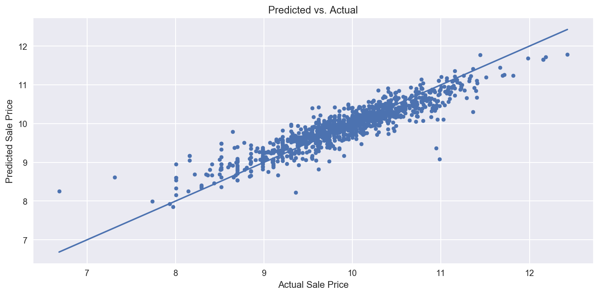

```python
import MySQLdb, pickle
import pandas as pd
from sqlalchemy import create_engine
from collections import Counter
```


```python
# read local car_info popular 
pw = pickle.load(open('./Data/pw.plk','rb'))

db = MySQLdb.connect(
    "127.0.0.1",
    "root",
    pw,
    "used_car",
    charset='utf8',
)

SQL_QUERY = """
    SELECT *
    FROM used_car;
"""

train = pd.read_sql(SQL_QUERY, db)
train.head(20)
```


<div>
<style>
    .dataframe thead tr:only-child th {
        text-align: right;
    }

    .dataframe thead th {
        text-align: left;
    }

    .dataframe tbody tr th {
        vertical-align: top;
    }
</style>
<table border="1" class="dataframe">
  <thead>
    <tr style="text-align: right;">
      <th></th>
      <th>index</th>
      <th>year</th>
      <th>title</th>
      <th>brand</th>
      <th>model</th>
      <th>miles</th>
      <th>photos</th>
      <th>video</th>
      <th>exterior_color</th>
      <th>interior_color</th>
      <th>transmission</th>
      <th>drivetrain</th>
      <th>star</th>
      <th>review_no</th>
      <th>vendor</th>
      <th>price</th>
    </tr>
  </thead>
  <tbody>
    <tr>
      <th>0</th>
      <td>0</td>
      <td>2003</td>
      <td>mazda tribute lx v6</td>
      <td>mazda</td>
      <td>tribute</td>
      <td>118205</td>
      <td>21</td>
      <td>1</td>
      <td>silver</td>
      <td>gray</td>
      <td>4-speed</td>
      <td>fwd</td>
      <td>5</td>
      <td>43</td>
      <td>1st choice autos</td>
      <td>3750</td>
    </tr>
    <tr>
      <th>1</th>
      <td>1</td>
      <td>2016</td>
      <td>subaru crosstrek 2.0i</td>
      <td>subaru</td>
      <td>crosstrek</td>
      <td>26525</td>
      <td>23</td>
      <td>1</td>
      <td>desert</td>
      <td>black</td>
      <td>5-speed</td>
      <td>4wd</td>
      <td>5</td>
      <td>43</td>
      <td>1st choice autos</td>
      <td>17999</td>
    </tr>
    <tr>
      <th>2</th>
      <td>2</td>
      <td>2018</td>
      <td>ford f-150 raptor</td>
      <td>ford</td>
      <td>f-150</td>
      <td>2330</td>
      <td>32</td>
      <td>1</td>
      <td>race</td>
      <td>black</td>
      <td>10-speed</td>
      <td>4wd</td>
      <td>5</td>
      <td>244</td>
      <td>gilbert &amp;  baugh ford</td>
      <td>53900</td>
    </tr>
    <tr>
      <th>3</th>
      <td>3</td>
      <td>2015</td>
      <td>lexus rc f</td>
      <td>lexus</td>
      <td>rc</td>
      <td>27080</td>
      <td>23</td>
      <td>1</td>
      <td>black</td>
      <td>red</td>
      <td>8-speed</td>
      <td>rwd</td>
      <td>5</td>
      <td>6</td>
      <td>carmax south boulevard</td>
      <td>43998</td>
    </tr>
    <tr>
      <th>4</th>
      <td>4</td>
      <td>2014</td>
      <td>mercedes-benz s 550</td>
      <td>mercedes-benz</td>
      <td>s</td>
      <td>121078</td>
      <td>32</td>
      <td>1</td>
      <td>palladium</td>
      <td>silk beige</td>
      <td>7-speed</td>
      <td>rwd</td>
      <td>5</td>
      <td>939</td>
      <td>hendrickbmw</td>
      <td>32991</td>
    </tr>
    <tr>
      <th>5</th>
      <td>5</td>
      <td>2016</td>
      <td>mercedes-benz gl 63 amg 4matic</td>
      <td>mercedes-benz</td>
      <td>gl</td>
      <td>17582</td>
      <td>32</td>
      <td>1</td>
      <td>black</td>
      <td>auburn brown</td>
      <td>7-speed</td>
      <td>4wd</td>
      <td>5</td>
      <td>19</td>
      <td>global motorsports inc.</td>
      <td>79895</td>
    </tr>
    <tr>
      <th>6</th>
      <td>6</td>
      <td>2017</td>
      <td>infiniti q50 3.0t premium</td>
      <td>infiniti</td>
      <td>q50</td>
      <td>31736</td>
      <td>26</td>
      <td>1</td>
      <td>platinum</td>
      <td>black</td>
      <td>7-speed</td>
      <td>rwd</td>
      <td>5</td>
      <td>18</td>
      <td>hertz car  sales winston-salem</td>
      <td>19998</td>
    </tr>
    <tr>
      <th>7</th>
      <td>7</td>
      <td>2016</td>
      <td>jeep compass latitude</td>
      <td>jeep</td>
      <td>compass</td>
      <td>46644</td>
      <td>25</td>
      <td>1</td>
      <td>granite</td>
      <td>dark slate</td>
      <td>6-speed</td>
      <td>fwd</td>
      <td>5</td>
      <td>90</td>
      <td>hertz car  sales  orlando</td>
      <td>11488</td>
    </tr>
    <tr>
      <th>8</th>
      <td>8</td>
      <td>2008</td>
      <td>subaru outback</td>
      <td>subaru</td>
      <td>outback</td>
      <td>199532</td>
      <td>29</td>
      <td>1</td>
      <td>gray</td>
      <td>gray</td>
      <td>6-speed</td>
      <td>4wd</td>
      <td>5</td>
      <td>16</td>
      <td>sharpmotors</td>
      <td>3950</td>
    </tr>
    <tr>
      <th>9</th>
      <td>9</td>
      <td>2016</td>
      <td>tesla model x p90d</td>
      <td>tesla</td>
      <td>model</td>
      <td>17342</td>
      <td>32</td>
      <td>1</td>
      <td>black</td>
      <td>black</td>
      <td>1-speed</td>
      <td>4wd</td>
      <td>5</td>
      <td>96</td>
      <td>bayshoreautomotive</td>
      <td>104890</td>
    </tr>
    <tr>
      <th>10</th>
      <td>10</td>
      <td>2004</td>
      <td>bmw 645 ci</td>
      <td>bmw</td>
      <td>645</td>
      <td>106334</td>
      <td>31</td>
      <td>1</td>
      <td>silver</td>
      <td>creme beige</td>
      <td>6-speed</td>
      <td>rwd</td>
      <td>5</td>
      <td>77</td>
      <td>rdu auto sales</td>
      <td>9995</td>
    </tr>
    <tr>
      <th>11</th>
      <td>11</td>
      <td>2010</td>
      <td>toyota tundra</td>
      <td>toyota</td>
      <td>tundra</td>
      <td>212000</td>
      <td>23</td>
      <td>1</td>
      <td>white</td>
      <td>tan</td>
      <td>6-speed</td>
      <td>4wd</td>
      <td>5</td>
      <td>6</td>
      <td>motortime auto sales</td>
      <td>11995</td>
    </tr>
    <tr>
      <th>12</th>
      <td>12</td>
      <td>2016</td>
      <td>chevrolet corvette z06</td>
      <td>chevrolet</td>
      <td>corvette</td>
      <td>11124</td>
      <td>28</td>
      <td>1</td>
      <td>beach</td>
      <td>brownstone</td>
      <td>8-speed</td>
      <td>rwd</td>
      <td>4</td>
      <td>86</td>
      <td>skylineimports</td>
      <td>67900</td>
    </tr>
    <tr>
      <th>13</th>
      <td>13</td>
      <td>2016</td>
      <td>lexus gs f base</td>
      <td>lexus</td>
      <td>gs</td>
      <td>30646</td>
      <td>32</td>
      <td>1</td>
      <td>nebula</td>
      <td>red</td>
      <td>8-speed</td>
      <td>rwd</td>
      <td>5</td>
      <td>117</td>
      <td>motorcarslouisiana</td>
      <td>56900</td>
    </tr>
    <tr>
      <th>14</th>
      <td>14</td>
      <td>2012</td>
      <td>ram 1500 st</td>
      <td>ram</td>
      <td>1500</td>
      <td>159272</td>
      <td>20</td>
      <td>1</td>
      <td>true</td>
      <td>dark slate medium</td>
      <td>6-speed</td>
      <td>rwd</td>
      <td>5</td>
      <td>10</td>
      <td>n &amp;  n  auto</td>
      <td>10935</td>
    </tr>
    <tr>
      <th>15</th>
      <td>15</td>
      <td>2008</td>
      <td>honda cr-v ex-l</td>
      <td>honda</td>
      <td>cr-v</td>
      <td>93043</td>
      <td>32</td>
      <td>1</td>
      <td>black</td>
      <td>gray</td>
      <td>5-speed</td>
      <td>4wd</td>
      <td>5</td>
      <td>7</td>
      <td>auto mart  of ohio</td>
      <td>8995</td>
    </tr>
    <tr>
      <th>16</th>
      <td>16</td>
      <td>2014</td>
      <td>maserati ghibli s q4</td>
      <td>maserati</td>
      <td>ghibli</td>
      <td>36037</td>
      <td>31</td>
      <td>1</td>
      <td>black</td>
      <td>black</td>
      <td>8-speed</td>
      <td>4wd</td>
      <td>5</td>
      <td>15</td>
      <td>creeksideauto</td>
      <td>33495</td>
    </tr>
    <tr>
      <th>17</th>
      <td>17</td>
      <td>2014</td>
      <td>mercedes-benz cla 250 4matic</td>
      <td>mercedes-benz</td>
      <td>cla</td>
      <td>40784</td>
      <td>32</td>
      <td>1</td>
      <td>white</td>
      <td>black</td>
      <td>7-speed</td>
      <td>4wd</td>
      <td>5</td>
      <td>23</td>
      <td>jumbo luxury cars</td>
      <td>16990</td>
    </tr>
    <tr>
      <th>18</th>
      <td>18</td>
      <td>2006</td>
      <td>rolls-royce phantom vi base</td>
      <td>rolls-royce</td>
      <td>phantom</td>
      <td>23050</td>
      <td>32</td>
      <td>1</td>
      <td>gray</td>
      <td>tan</td>
      <td>6-speed</td>
      <td>rwd</td>
      <td>5</td>
      <td>23</td>
      <td>jumbo luxury cars</td>
      <td>105000</td>
    </tr>
    <tr>
      <th>19</th>
      <td>19</td>
      <td>2015</td>
      <td>mercedes-benz c 300</td>
      <td>mercedes-benz</td>
      <td>c</td>
      <td>35286</td>
      <td>32</td>
      <td>1</td>
      <td>silver</td>
      <td>black</td>
      <td>7-speed</td>
      <td>4wd</td>
      <td>5</td>
      <td>23</td>
      <td>jumbo luxury cars</td>
      <td>23990</td>
    </tr>
  </tbody>
</table>
</div>


```python
brand_list = []
for brand in Counter(train.brand).most_common(30):
    brand_list.append(brand[0])
```


```python
idx_list = []
idx = 0
for i in train["brand"]:
    if i not in brand_list:
        idx_list.append(idx)
    idx += 1
```


```python
train.shape
```


    (4997, 16)


```python
train = train.drop(idx_list)
train.reset_index(drop=True, inplace=True)
train = train.drop("index", axis=1)
```

Feature engineering


```python
categorical_features = ['brand', 'model']
```


```python
dummy_cat = pd.get_dummies(train[categorical_features])
dummy_cat.head()
```


<div>
<style>
    .dataframe thead tr:only-child th {
        text-align: right;
    }

    .dataframe thead th {
        text-align: left;
    }

    .dataframe tbody tr th {
        vertical-align: top;
    }
</style>
<table border="1" class="dataframe">
  <thead>
    <tr style="text-align: right;">
      <th></th>
      <th>brand_acura</th>
      <th>brand_audi</th>
      <th>brand_bmw</th>
      <th>brand_buick</th>
      <th>brand_cadillac</th>
      <th>brand_chevrolet</th>
      <th>brand_chrysler</th>
      <th>brand_dodge</th>
      <th>brand_ford</th>
      <th>brand_gmc</th>
      <th>...</th>
      <th>model_xf</th>
      <th>model_xj</th>
      <th>model_xk</th>
      <th>model_xt5</th>
      <th>model_xterra</th>
      <th>model_xts</th>
      <th>model_xv</th>
      <th>model_yaris</th>
      <th>model_yukon</th>
      <th>model_z4</th>
    </tr>
  </thead>
  <tbody>
    <tr>
      <th>0</th>
      <td>0</td>
      <td>0</td>
      <td>0</td>
      <td>0</td>
      <td>0</td>
      <td>0</td>
      <td>0</td>
      <td>0</td>
      <td>0</td>
      <td>0</td>
      <td>...</td>
      <td>0</td>
      <td>0</td>
      <td>0</td>
      <td>0</td>
      <td>0</td>
      <td>0</td>
      <td>0</td>
      <td>0</td>
      <td>0</td>
      <td>0</td>
    </tr>
    <tr>
      <th>1</th>
      <td>0</td>
      <td>0</td>
      <td>0</td>
      <td>0</td>
      <td>0</td>
      <td>0</td>
      <td>0</td>
      <td>0</td>
      <td>0</td>
      <td>0</td>
      <td>...</td>
      <td>0</td>
      <td>0</td>
      <td>0</td>
      <td>0</td>
      <td>0</td>
      <td>0</td>
      <td>0</td>
      <td>0</td>
      <td>0</td>
      <td>0</td>
    </tr>
    <tr>
      <th>2</th>
      <td>0</td>
      <td>0</td>
      <td>0</td>
      <td>0</td>
      <td>0</td>
      <td>0</td>
      <td>0</td>
      <td>0</td>
      <td>1</td>
      <td>0</td>
      <td>...</td>
      <td>0</td>
      <td>0</td>
      <td>0</td>
      <td>0</td>
      <td>0</td>
      <td>0</td>
      <td>0</td>
      <td>0</td>
      <td>0</td>
      <td>0</td>
    </tr>
    <tr>
      <th>3</th>
      <td>0</td>
      <td>0</td>
      <td>0</td>
      <td>0</td>
      <td>0</td>
      <td>0</td>
      <td>0</td>
      <td>0</td>
      <td>0</td>
      <td>0</td>
      <td>...</td>
      <td>0</td>
      <td>0</td>
      <td>0</td>
      <td>0</td>
      <td>0</td>
      <td>0</td>
      <td>0</td>
      <td>0</td>
      <td>0</td>
      <td>0</td>
    </tr>
    <tr>
      <th>4</th>
      <td>0</td>
      <td>0</td>
      <td>0</td>
      <td>0</td>
      <td>0</td>
      <td>0</td>
      <td>0</td>
      <td>0</td>
      <td>0</td>
      <td>0</td>
      <td>...</td>
      <td>0</td>
      <td>0</td>
      <td>0</td>
      <td>0</td>
      <td>0</td>
      <td>0</td>
      <td>0</td>
      <td>0</td>
      <td>0</td>
      <td>0</td>
    </tr>
  </tbody>
</table>
<p>5 rows × 433 columns</p>
</div>


```python
numerical_features = ['year', 'miles','price']
```


```python
normalize_num = np.log1p(train[numerical_features])
normalize_num.head()
```


<div>
<style>
    .dataframe thead tr:only-child th {
        text-align: right;
    }

    .dataframe thead th {
        text-align: left;
    }

    .dataframe tbody tr th {
        vertical-align: top;
    }
</style>
<table border="1" class="dataframe">
  <thead>
    <tr style="text-align: right;">
      <th></th>
      <th>year</th>
      <th>miles</th>
      <th>price</th>
    </tr>
  </thead>
  <tbody>
    <tr>
      <th>0</th>
      <td>7.602900</td>
      <td>11.680184</td>
      <td>8.229778</td>
    </tr>
    <tr>
      <th>1</th>
      <td>7.609367</td>
      <td>10.185881</td>
      <td>9.798127</td>
    </tr>
    <tr>
      <th>2</th>
      <td>7.610358</td>
      <td>7.754053</td>
      <td>10.894904</td>
    </tr>
    <tr>
      <th>3</th>
      <td>7.608871</td>
      <td>10.206588</td>
      <td>10.691922</td>
    </tr>
    <tr>
      <th>4</th>
      <td>7.608374</td>
      <td>11.704199</td>
      <td>10.404020</td>
    </tr>
  </tbody>
</table>
</div>


```python
# pre_train = pd.merge(normalize_num, dummy_cat) 
X_train_0 = normalize_num.join(dummy_cat)
y_train = X_train_0["price"]
X_train = X_train_0.drop("price", axis=1)
```


```python
from xgboost import XGBRegressor
from sklearn.cross_validation import train_test_split
from sklearn.model_selection import cross_val_score
from sklearn.model_selection import KFold

k_fold = KFold(n_splits=10, shuffle=True, random_state=2018)
X_train1, X_test1, y_train1, y_test1 = train_test_split(X_train, y_train)
```


```python
ml = XGBRegressor(n_estimators=1000, learning_rate=0.05, verbose=False)
```


```python
%time score = cross_val_score(ml, X_train, y_train, cv=k_fold, n_jobs=-1, scoring="r2").mean()

print("Score = {0:.5f}".format(score))
```

    CPU times: user 228 ms, sys: 105 ms, total: 333 ms
    Wall time: 2min 20s
    Score = 0.83457


```python
ml = ml.fit(X_train1, y_train1)
y_pred = ml.predict(X_test1)

plt.figure(figsize=(10, 5))
plt.scatter(y_test1, y_pred, s=20)
plt.title('Predicted vs. Actual')
plt.xlabel('Actual Sale Price')
plt.ylabel('Predicted Sale Price')

plt.plot([min(y_test1), max(y_test1)], [min(y_test1), max(y_test1)])
plt.tight_layout()
```





```python
pickle.dump(ml, open("./Flask/models/model.plk","wb"))
```


```python
actual_car_info = train[["brand", "model","year","miles","price"]]
pickle.dump(actual_car_info, open("./Flask/models/actual_car_info.plk","wb"))
```


```python
brand = str(input("brand: "))
model = str(input("model: "))
year = int(input("year: "))
miles = int(input("miles: "))
```

    brand: kia
    model: optima
    year: 2011
    miles: 35000


```python
target = pd.DataFrame(columns = [X_train1.columns])
```


```python
pickle.dump(X_train1.columns, open("./Flask/models/column.plk","wb"))
```


```python
cdx = 0
for col in X_train.columns:
    if col == 'brand'+"_"+brand:
        break;
    cdx += 1
cdx
```


    17


```python
sdx = 0
for col in X_train.columns:
    if col == 'model'+"_"+model:
        break;
    sdx += 1
sdx
```


    302


```python
target_list = np.zeros_like(X_train.loc[0])
```


```python
pickle.dump(target_list, open("./Flask/models/target_list.plk","wb"))
```


```python
target_list[cdx] = 1
target_list[sdx] = 1
target_list[0] = year
target_list[1] = miles
```


```python
for i in range(1):
    target.loc[i] = target_list
```


```python
target
```


<div>
<style>
    .dataframe thead tr:only-child th {
        text-align: right;
    }

    .dataframe thead th {
        text-align: left;
    }

    .dataframe tbody tr th {
        vertical-align: top;
    }
</style>
<table border="1" class="dataframe">
  <thead>
    <tr style="text-align: right;">
      <th></th>
      <th>year</th>
      <th>miles</th>
      <th>brand_acura</th>
      <th>brand_audi</th>
      <th>brand_bmw</th>
      <th>brand_buick</th>
      <th>brand_cadillac</th>
      <th>brand_chevrolet</th>
      <th>brand_chrysler</th>
      <th>brand_dodge</th>
      <th>...</th>
      <th>model_xf</th>
      <th>model_xj</th>
      <th>model_xk</th>
      <th>model_xt5</th>
      <th>model_xterra</th>
      <th>model_xts</th>
      <th>model_xv</th>
      <th>model_yaris</th>
      <th>model_yukon</th>
      <th>model_z4</th>
    </tr>
  </thead>
  <tbody>
    <tr>
      <th>0</th>
      <td>2011.0</td>
      <td>35000.0</td>
      <td>0.0</td>
      <td>0.0</td>
      <td>0.0</td>
      <td>0.0</td>
      <td>0.0</td>
      <td>0.0</td>
      <td>0.0</td>
      <td>0.0</td>
      <td>...</td>
      <td>0.0</td>
      <td>0.0</td>
      <td>0.0</td>
      <td>0.0</td>
      <td>0.0</td>
      <td>0.0</td>
      <td>0.0</td>
      <td>0.0</td>
      <td>0.0</td>
      <td>0.0</td>
    </tr>
  </tbody>
</table>
<p>1 rows × 435 columns</p>
</div>


```python
numerical_features = ['year', 'miles']
target[numerical_features] = np.log1p(target[numerical_features])
```


```python
target
```


<div>
<style>
    .dataframe thead tr:only-child th {
        text-align: right;
    }

    .dataframe thead th {
        text-align: left;
    }

    .dataframe tbody tr th {
        vertical-align: top;
    }
</style>
<table border="1" class="dataframe">
  <thead>
    <tr style="text-align: right;">
      <th></th>
      <th>year</th>
      <th>miles</th>
      <th>brand_acura</th>
      <th>brand_audi</th>
      <th>brand_bmw</th>
      <th>brand_buick</th>
      <th>brand_cadillac</th>
      <th>brand_chevrolet</th>
      <th>brand_chrysler</th>
      <th>brand_dodge</th>
      <th>...</th>
      <th>model_xf</th>
      <th>model_xj</th>
      <th>model_xk</th>
      <th>model_xt5</th>
      <th>model_xterra</th>
      <th>model_xts</th>
      <th>model_xv</th>
      <th>model_yaris</th>
      <th>model_yukon</th>
      <th>model_z4</th>
    </tr>
  </thead>
  <tbody>
    <tr>
      <th>0</th>
      <td>7.606885</td>
      <td>10.463132</td>
      <td>0.0</td>
      <td>0.0</td>
      <td>0.0</td>
      <td>0.0</td>
      <td>0.0</td>
      <td>0.0</td>
      <td>0.0</td>
      <td>0.0</td>
      <td>...</td>
      <td>0.0</td>
      <td>0.0</td>
      <td>0.0</td>
      <td>0.0</td>
      <td>0.0</td>
      <td>0.0</td>
      <td>0.0</td>
      <td>0.0</td>
      <td>0.0</td>
      <td>0.0</td>
    </tr>
  </tbody>
</table>
<p>1 rows × 435 columns</p>
</div>


```python
price_log = ml.predict(target)
```


```python
price_log
```


    array([ 9.39924717], dtype=float32)


```python
price = np.exp(price_log)
print("Price:", int(price))
```

    Price: 12079


```python
same_brand = actual_car_info[actual_car_info["brand"]==brand] 
year_price = same_brand[["year", "price"]]
year_price_list = year_price.groupby("year").agg({'price':np.mean}).astype('int')
year_price_list = year_price_list.reset_index()
year_price_list
```


<div>
<style>
    .dataframe thead tr:only-child th {
        text-align: right;
    }

    .dataframe thead th {
        text-align: left;
    }

    .dataframe tbody tr th {
        vertical-align: top;
    }
</style>
<table border="1" class="dataframe">
  <thead>
    <tr style="text-align: right;">
      <th></th>
      <th>year</th>
      <th>price</th>
    </tr>
  </thead>
  <tbody>
    <tr>
      <th>0</th>
      <td>2005</td>
      <td>2795</td>
    </tr>
    <tr>
      <th>1</th>
      <td>2010</td>
      <td>4972</td>
    </tr>
    <tr>
      <th>2</th>
      <td>2011</td>
      <td>8347</td>
    </tr>
    <tr>
      <th>3</th>
      <td>2012</td>
      <td>9199</td>
    </tr>
    <tr>
      <th>4</th>
      <td>2013</td>
      <td>10690</td>
    </tr>
    <tr>
      <th>5</th>
      <td>2014</td>
      <td>15076</td>
    </tr>
    <tr>
      <th>6</th>
      <td>2015</td>
      <td>15105</td>
    </tr>
    <tr>
      <th>7</th>
      <td>2016</td>
      <td>15431</td>
    </tr>
    <tr>
      <th>8</th>
      <td>2017</td>
      <td>19264</td>
    </tr>
    <tr>
      <th>9</th>
      <td>2018</td>
      <td>28471</td>
    </tr>
  </tbody>
</table>
</div>


```python
model_price_list = same_brand.groupby("model").agg({'price':np.mean}).astype('int')
model_price_list = model_price_list.reset_index()
model_price_list
```


<div>
<style>
    .dataframe thead tr:only-child th {
        text-align: right;
    }

    .dataframe thead th {
        text-align: left;
    }

    .dataframe tbody tr th {
        vertical-align: top;
    }
</style>
<table border="1" class="dataframe">
  <thead>
    <tr style="text-align: right;">
      <th></th>
      <th>model</th>
      <th>price</th>
    </tr>
  </thead>
  <tbody>
    <tr>
      <th>0</th>
      <td>amanti</td>
      <td>2795</td>
    </tr>
    <tr>
      <th>1</th>
      <td>cadenza</td>
      <td>17674</td>
    </tr>
    <tr>
      <th>2</th>
      <td>forte</td>
      <td>10161</td>
    </tr>
    <tr>
      <th>3</th>
      <td>niro</td>
      <td>24600</td>
    </tr>
    <tr>
      <th>4</th>
      <td>optima</td>
      <td>14591</td>
    </tr>
    <tr>
      <th>5</th>
      <td>rio</td>
      <td>9070</td>
    </tr>
    <tr>
      <th>6</th>
      <td>sedona</td>
      <td>21017</td>
    </tr>
    <tr>
      <th>7</th>
      <td>sorento</td>
      <td>17949</td>
    </tr>
    <tr>
      <th>8</th>
      <td>soul</td>
      <td>11900</td>
    </tr>
    <tr>
      <th>9</th>
      <td>sportage</td>
      <td>17477</td>
    </tr>
    <tr>
      <th>10</th>
      <td>stinger</td>
      <td>37488</td>
    </tr>
  </tbody>
</table>
</div>


